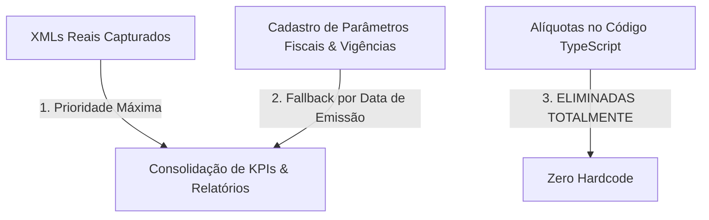
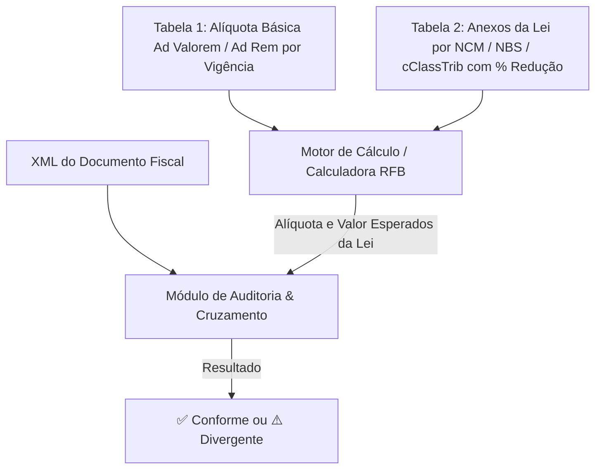

### 2. Varredura Completa: Onde existem menções a alíquotas no sistema hoje

Realizamos uma varredura rigorosa em toda a base de código (frontend, backend e banco de dados). Identificamos exatamente onde e como as alíquotas estão sendo referenciadas:

| Componente / Módulo | Arquivo(s) | Como está hoje | O que precisa mudar |
| :--- | :--- | :--- | :--- |
| **Painel de KPIs & BI** | [CentralKpisPanel.tsx](file:///c:/Automacoes/Radar%20Conformidade%20Fiscal/src/components/CentralKpisPanel.tsx) | Multiplica o `valorTotal` por alíquotas nominais estimadas (`8.8%`, `10.62%`, `7.08%`) e exibe porcentagens fixas nos títulos dos cards. | **1)** Somar os valores reais destacados nos itens dos XMLs. **2)** Remover rótulos estáticos de porcentagem nos títulos. **3)** Quando necessário simular, buscar da tabela de vigência do banco. |
| **Motor de Transição** | [reformaTransicao.ts](file:///c:/Automacoes/Radar%20Conformidade%20Fiscal/src/utils/reformaTransicao.ts) | Possui uma matriz estática `CRONOGRAMA_TRANSICAO_REFORMA` com anos 2026 a 2033 e alíquotas fixas gravadas em código (`0.9%`, `0.1%`, `8.8%`, `17.7%`, etc.). | Substituir a matriz estática por consulta à tabela de **Parâmetros e Vigências Fiscais** gravada no banco de dados. |
| **Parâmetros & Tabelas Fiscais** | [TabelasFiscaisPanel.tsx](file:///c:/Automacoes/Radar%20Conformidade%20Fiscal/src/components/TabelasFiscaisPanel.tsx) [tables.ts](file:///c:/Automacoes/Radar%20Conformidade%20Fiscal/server/routes/tables.ts) | A tabela `aliquotas_referencia` existe no banco, mas a tela possui apenas 2 inputs simplificados e inicializava com estados padrão `useState(8.8)` e `useState(17.7)`. | Expandir a tela para permitir o cadastro/edição de **Tabelas de Alíquotas por Período / Ano**, segregadas por **CBS Federal**, **IBS Estadual (UF)**, **IBS Municipal (Município)**, com data de início e fim de vigência. |
| **Parser e Carga de XML** | [xmlParser.ts](file:///c:/Automacoes/Radar%20Conformidade%20Fiscal/src/utils/xmlParser.ts) [DfeManagerPanel.tsx](file:///c:/Automacoes/Radar%20Conformidade%20Fiscal/src/components/DfeManagerPanel.tsx) [App.tsx](file:///c:/Automacoes/Radar%20Conformidade%20Fiscal/src/App.tsx) | Lê `<pCBS>` e `<pIBS>` se existirem no XML (NT 2025.002). Porém, em notas pré-reforma ou na ausência da tag, aplicava `8.8` / `17.7` como fallback. | Se não houver destaque no XML, buscar as alíquotas do cadastro de vigências fiscais baseado na `dataEmissao` da nota, sem valores fixos em código. |
| **Auditoria e Simuladores** | [auditoriaCredito.ts](file:///c:/Automacoes/Radar%20Conformidade%20Fiscal/src/utils/auditoriaCredito.ts) [SplitPaymentModal.tsx](file:///c:/Automacoes/Radar%20Conformidade%20Fiscal/src/components/SplitPaymentModal.tsx) [DanfeModal.tsx](file:///c:/Automacoes/Radar%20Conformidade%20Fiscal/src/components/DanfeModal.tsx) | Possuem valores padrão (`aliquotaCbsDoc = 8.8`) ou textos de exibição com porcentagem. | Usar estritamente a alíquota real do item do XML ou a alíquota do parâmetro fiscal do período. |

---

### 3. Proposta de Arquitetura Fiscal Dinâmica (Zero Alíquotas em Código)

Para atender perfeitamente à sua diretriz, propomos estruturar o sistema em **3 Pilares**:

#### Pilar 1: Cadastro Dinâmico de Alíquotas por Vigência (Ano / Período / UF / Município)
* Permitir cadastrar na tela de **Parâmetros Fiscais**:
  * **Tributo**: CBS (Federal), IBS Estadual (por UF ou Geral), IBS Municipal (por Município ou Geral);
  * **Vigência Inicial e Final** (ex: `01/01/2026` a `31/12/2026`, `01/01/2027` a `31/12/2027`, etc.);
  * **Alíquota Padrão (%)**, **Alíquota Cesta Básica (%)**, **Reduções Especiais (%)**;
* Gravadas 100% no banco de dados (`aliquotas_referencia` no Supabase/SQLite).

#### Pilar 2: KPIs Baseados nos Valores Reais dos XMLs
* Os cards da **Central de KPIs** deixam de fazer contas multiplicando o valor bruto total por uma taxa teórica.
* Eles passam a consolidar a **soma real dos tributos destacados nos itens dos XMLs** (`valorCbs`, `valorIbs`, `valorIcms`, `valorPis`, `valorCofins`, `valorIpi`), respeitando a realidade de cada nota (inclusive notas com alíquota zero, isenção ou reduções).

#### Pilar 3: Rótulos Limpos e Não Indutivos nos KPIs
* Remover porcentagens fixas dos títulos dos cards (ex: mudar de `"CBS Federal (8.80%)"` para `"CBS Federal"`, exibindo opcionalmente a **alíquota média efetiva real da carteira de XMLs**).

---

### 💬 Como você prefere que estruturemos essa tela de cadastro de vigências e o comportamento dos KPIs? 
Podemos detalhar juntos o formato ideal antes de qualquer alteração de código.

Sua visão estratégica está **100% alinhada com o que há de mais moderno na arquitetura fiscal da Reforma Tributária**. 

Respondendo diretamente à sua pergunta: **NÃO será retrabalho nem dois trabalhos! Pelo contrário: é o caminho mais inteligente e modular possível.**

Veja por que essa arquitetura se encaixa com perfeição:

---

### 1. Por que a sua ideia da Tabela de Anexos (NCM/NBS) não gera retrabalho?

A calculadora oficial de código aberto da **RFB (Receita Federal / RTC)** funciona exatamente sob essa mesma estrutura de 3 blocos:

1. **A Tabela de Alíquotas Básicas** (as duas que você desenhou: Ad Valorem e Ad Rem por vigência) define o ponto de partida nacional, estadual e municipal.
2. **A Tabela de Anexos (NCM / NBS / cClassTrib)** define a regra do produto:
   * Exemplo: *NCM do Anexo da Cesta Básica* $\rightarrow$ Redução de 100% (Alíquota Zero).
   * Exemplo: *NCM de Medicamentos / Saúde* $\rightarrow$ Redução de 60%.
   * Exemplo: *NCM de Serviços da LC 214/2025* $\rightarrow$ Redução de 30%.
   * Exemplo: *NCM de GLP / Combustíveis* $\rightarrow$ Aplica Tabela Ad Rem (R$/kg).
3. **O Motor de Cálculo**:
   * Pega a alíquota básica da vigência;
   * Aplica o redutor da tabela de NCM/NBS;
   * Entrega o valor esperado exato.

---

### 2. A integração com o Motor da RFB no futuro:

* Quando ativarmos o motor da Calculadora da RFB (que o Fisco disponibilizou como biblioteca aberta), ele consumirá **exatamente essas mesmas tabelas** que você está modelando agora!
* Portanto, **tudo o que fizermos agora é reaproveitamento direto de 100%**, sem jogar fora uma linha sequer de dados ou de regras.

---

### 3. Como podemos estruturar as Tabelas no sistema:

Podemos organizar o módulo de **Parâmetros Fiscais** em 3 abas claras e objetivas:

1. **Aba 1 — Alíquotas Ad Valorem (%)**:
   * Tabela com vigência (Início / Fim), CBS Federal, IBS Estadual, IBS Municipal, IS Federal (exatamente como no seu print).
2. **Aba 2 — Alíquotas Ad Rem (R$ por Unidade)**:
   * Tabela com vigência (Início / Fim), CBS Federal, IBS Estadual, IBS Municipal, IS Federal em valores fixos (para GLP, combustíveis, etc.).
3. **Aba 3 — Anexos & Regimes Especiais (NCM / NBS / cClassTrib)**:
   * Upload em lote (Excel/CSV) ou cadastro individual de NCM/NBS;
   * Tipo de Tratamento (Alíquota Padrão, Redução 60%, Redução 30%, Alíquota Zero / Isenção, Ad Rem, Monofásico);
   * Base Legal vinculada (Artigo / Anexo da LC 214/2025).

---

### 💡 Vantagem prática para o seu dia a dia:
* Se o Governo publicar um novo decreto alterando uma alíquota ou incluindo um novo NCM na cesta básica reduzida, **você não precisa de programador**: basta subir a nova planilha ou editar a linha na tela com a nova data de vigência!

Se concordar com esse formato, posso montar o plano e começarmos a estruturar essas tabelas dinâmicas e os novos KPIs!