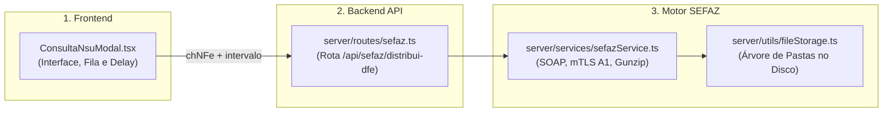

Para aproveitar essa funcionalidade em outra ferramenta, você precisará de **5 arquivos principais** que compõem o fluxo completo (interface, fila anti-bloqueio, rota backend, cliente SOAP com certificado A1 e salvamento automático no disco).

---

Crie um app para buscar XML na Sefaz com base em lista de chave de acesso.
### 📁 Arquivos Necessários e suas Responsabilidades



---

### 1. Frontend (Interface, Fila e Controle de Cota)
* [src/components/ConsultaNsuModal.tsx](file:///c:/Automacoes/Radar%20Conformidade%20Fiscal/src/components/ConsultaNsuModal.tsx)
  * **O que copiar deste arquivo:**
    * **Sub-modo Chave Única:** A validação dos 44 dígitos com regex, botão colar e acionamento direto via `handleStartConsultaDFe(true)`.
    * **Sub-modo Lote Massivo (`handleStartBatchDownload`):**
      * Extração de chaves a partir de texto colado (`textarea`) ou importação de planilhas Excel (`.xlsx`/`.xls`/`.csv`) com a lib `xlsx`.
      * Fila sequencial com controle de intervalo ajustável (`intervalMs`: 1000ms a 2000ms) para evitar o bloqueio da SEFAZ (`cStat 656 - Consumo Indevido`).
      * Controle de estado (Pausar, Retomar, Cancelar).
      * Barra de progresso com ETA (tempo restante estimado) e contadores de sucesso/erro.
      * Geração e download do pacote `.zip` de XMLs com a biblioteca `jszip` (`handleDownloadZip`).

---

### 2. Backend — Rota da API
* [server/routes/sefaz.ts](file:///c:/Automacoes/Radar%20Conformidade%20Fiscal/server/routes/sefaz.ts)
  * **O que copiar deste arquivo:**
    * Rota `POST /api/sefaz/distribui-dfe`.
    * Recebe `{ cnpj, chNFe, tpAmb, fluxo }`.
    * Recupera o certificado A1 correspondente da empresa e repassa os parâmetros para a função `consultarDistribuicaoDFe(...)`.

---

### 3. Backend — Motor SOAP SEFAZ com Certificado Digital A1
* [server/services/sefazService.ts](file:///c:/Automacoes/Radar%20Conformidade%20Fiscal/server/services/sefazService.ts)
  * **É o arquivo mais importante do backend**.
  * **O que copiar deste arquivo:**
    * Função `consultarDistribuicaoDFe(...)`.
    * Leitura e descriptografia do Certificado Digital A1 (`.pfx`) em memória via `node-forge` e `crypto`.
    * Criação do `https.Agent` com TLS mútuo (mTLS) para autenticação segura com os servidores da Fazenda.
    * Montagem do envelope SOAP XML oficial:
      ```xml
      <consChave>
        <chNFe>41260877765840000170550030005478051771547460</chNFe>
      </consChave>
      ```
    * Envio para o WebService `NFeDistribuicaoDFe` da SEFAZ.
    * Descompressão em memória (`zlib.gunzipSync`) do arquivo compactado em Base64 retornado na tag `<docZip>`.
    * Extração e retorno do XML completo da NF-e (`procNFe`).

---

### 4. Backend — Salvamento Automático em Disco
* [server/utils/fileStorage.ts](file:///c:/Automacoes/Radar%20Conformidade%20Fiscal/server/utils/fileStorage.ts)
  * **O que copiar deste arquivo:**
    * Função `salvarXmlLocalmente(xmlContent, cnpjRaiz, tipoOperacao, dataEmissaoIso, chaveAcesso)`.
    * Cria automaticamente a árvore de pastas no padrão:  
      `C:\SEFAZ\XMLs\[CNPJ_RAIZ]\[Entrada|Saida]\[Ano]\[Mês]\[chave].xml`.

---

### 5. Configurações de Endpoints SEFAZ
* [server/config.ts](file:///c:/Automacoes/Radar%20Conformidade%20Fiscal/server/config.ts)
  * **O que copiar deste arquivo:**
    * As URLs oficiais dos WebServices de Distribuição DF-e:
      * **Produção:** `https://www1.nfe.fazenda.gov.br/NFeDistribuicaoDFe/NFeDistribuicaoDFe.asmx`
      * **Homologação:** `https://hom1.nfe.fazenda.gov.br/NFeDistribuicaoDFe/NFeDistribuicaoDFe.asmx`

---

### 📦 Dependências npm necessárias na nova ferramenta
Se for criar um novo projeto com esse código, instale estas bibliotecas:

```bash
# Backend
npm install node-forge xml2js dotenv express cors

# Frontend
npm install jszip xlsx lucide-react
```