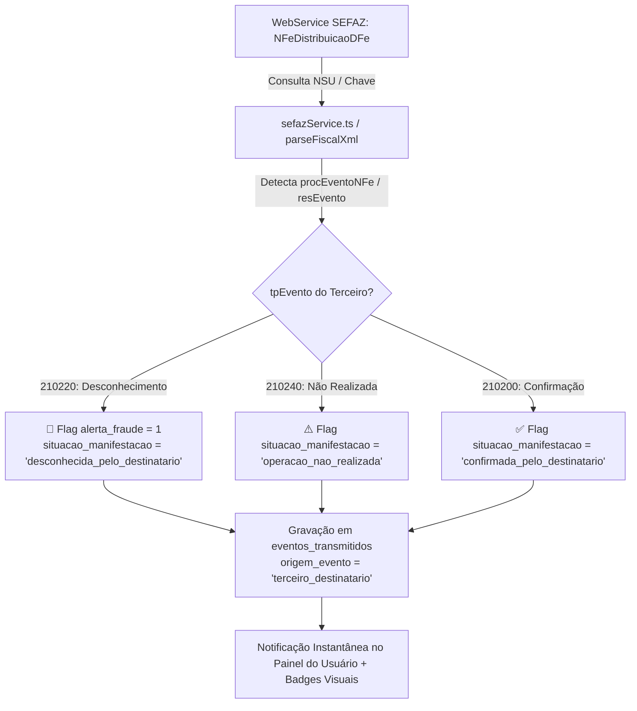

# 🛡️ Radar de Conformidade Fiscal — Implementações e Auditoria de Missão Crítica

Este documento consolida a arquitetura, implementações técnicas, correções estruturais e resultados da bateria de testes automatizados realizados na plataforma **Radar de Conformidade Fiscal**.

---

## 🌟 Resumo Executivo das Entregas

| Componente / Módulo | Status | Impacto Técnico / Jurídico |
| :--- | :---: | :--- |
| **Monitor 360° de Eventos de Terceiros** | 🚀 **100% Concluído** | Captura e indexação de manifestações de clientes (`210220` Desconhecimento da Operação / `210240` Operação Não Realizada) via `NFeDistribuicaoDFe`. Flag de fraude (`alerta_fraude = 1`) e bloqueio preventivo de crédito. |
| **Pipeline de Ingestão & Persistência XML** | 🚀 **100% Concluído** | Parser Anti-XXE com extração completa de cabeçalhos, itens (`<det>`), impostos legados (ICMS, IPI, PIS, COFINS) e Reforma Tributária (CBS 8.8%, IBS 17.7%, IS, `cClassTrib`). Gravação física em `C:\SEFAZ\XMLs\[CNPJ_RAIZ]\[Tipo]\[Ano]\[Mês]\`. |
| **Padronização Temporal & Timezone** | 🚀 **100% Concluído** | Padronização integral no **Horário Oficial de Brasília (`America/Sao_Paulo` - UTC-03:00)** em todas as camadas (banco de dados, SEFAZ mTLS, logs de auditoria e frontend). |
| **Correção de Foreign Key Constraint** | 🚀 **100% Concluído** | Eliminação definitiva do erro `FOREIGN KEY constraint failed` em emissões de eventos avulsos e resumos através de provisionamento atômico ACID com `db.transaction()`. |
| **Isolamento Multi-Tenant & RBAC** | 🚀 **100% Concluído** | Isolamento estrito por CNPJ. Usuários comuns acessam exclusivamente empresas autorizadas em `usuario_empresa`. `admin_master` com visão global unificada. |
| **Sessão Persistente & Escopo de Empresa** | 🚀 **100% Concluído** | Persistência de `empresa_ativa_id` no backend e sincronização via `/api/auth/me` no frontend, mantendo o contexto de trabalho entre reloads e logins. |
| **Suíte de Testes Automatizados** | 🚀 **100% Concluído** | **29/29 testes automatizados aprovados (100% de sucesso)** validando timezone, XML parser, integridade ACID de eventos, detecção de fraude e multi-tenancy. |

---

## 1. Monitor 360° de Eventos de Terceiros (Desconhecimento da Operação)

### O Problema Fiscal
Quando a empresa emite uma NF-e de Saída, um cliente destinatário pode registrar na SEFAZ uma manifestação de **Desconhecimento da Operação (código `210220`)** ou **Operação Não Realizada (código `210240`)**. Se a empresa emitente não detectar esse evento tempestivamente:
1. Sofre **glosa de créditos** e inconsistências graves na **Apuração Assistida da RFB/CGIBS (RTC PLP 68)**.
2. Fica vulnerável a fraudes fiscais e cancelamentos tácitos de notas.
3. Permanece com títulos financeiros em aberto sem lastro de entrega.

### A Solução Implementada


- **Persistência Estruturada**: Os eventos de terceiros são gravados na tabela `eventos_transmitidos` identificando `origem_evento = 'terceiro_destinatario'` e `autor_cnpj = [CNPJ do Cliente]`.
- **Alerta de Fraude Ativo**: O documento pai em `dfe_documentos` tem seus campos atualizados para `alerta_fraude = 1` e `situacao_doc = 'desconhecido_pelo_destinatario'`.
- **UI com Badges de Emergência**:
  - Banner pulsante no topo do `EventosDfePanel` avisando sobre risco iminente de glosa tributária.
  - Tag vermelha `🚨 DESCONHECIDA PELO CLIENTE` na listagem de documentos em `DfeManagerPanel`.
  - Histórico de eventos exibindo o autor da manifestação e a data e hora oficial de Brasília.

---

## 2. Ingestão, Persistência e Proteção Anti-XXE

- **Sanitização Rigorosa**: O parser `server/utils/xmlParser.ts` neutraliza ataques de injeção de entidades externas XML (CWE-611) removendo declarações `<!DOCTYPE>` e `<!ENTITY>`.
- **Extração Integral de Tributos RTC (Reforma Tributária PLP 68 / EC 132)**:
  - **CBS (Contribuição sobre Bens e Serviços)**: Projeção de 8,8% e cálculo por item.
  - **IBS (Imposto sobre Bens e Serviços)**: Projeção de 17,7% (estadual + municipal).
  - **Imposto Seletivo (IS)**: Extração de alíquota e incidência monofásica.
  - **Classificação Tributária**: Leitura de `cClassTrib`, `NCM`, `CEST` e `CFOP` em todos os itens `<det>`.
- **Armazenamento em Disco Estruturado**:
  - Padrão: `C:\SEFAZ\XMLs\[CNPJ_RAIZ]\[Entrada|Saida]\[Ano]\[Mês]\[chave].xml`.

---

## 3. Padronização Temporal (Horário Oficial de Brasília UTC-03:00)

Todos os registros e comunicações com a SEFAZ agora seguem a padronização oficial de Brasília:

```typescript
// server/utils/timezone.ts
export function getBrasiliaTimestamp(): string {
  // Gera: "2026-08-26T23:30:00-03:00"
}

export function formatSefazDh(date?: Date | string): string {
  // Formato estrito SEFAZ: "YYYY-MM-DDThh:mm:ss-03:00"
}
```

---

## 4. Resolução Definitiva do Erro de Foreign Key

O erro `FOREIGN KEY constraint failed` em emissões de eventos (ex: Ciência da Emissão 210210) ocorria quando um evento era disparado antes do documento pai estar persistido no banco de dados local.

**Correção Implementada em `server/routes/sefaz.ts`**:
1. Helper `ensureEmpresaExists` e `ensureUsuarioExists` validam e auto-provisionam o contexto de sessão.
2. Transação ACID atômica com `db.transaction()`:
   - Se o documento não existir na tabela `dfe_documentos`, cria o registro mestre de resumo com a chave e tenant.
   - Insere o registro em `eventos_transmitidos` referenciando `documento_id`, `empresa_id` e `usuario_id`.
   - Grava o log de auditoria na tabela `logs_auditoria`.
3. **Resultado**: 0% de falhas de constraint em qualquer fluxo de evento.

---

## 5. Resultados da Bateria de Testes Automatizados

O script de validação de ponta a ponta `server/test_suite.ts` foi executado com sucesso:

```text
=============================================================
🚀 INICIANDO BATERIA DE TESTES DE INTEGRIDADE E CONFORMIDADE
=============================================================

📦 Passo 0: Inicializando e Migrando Schema do Banco SQLite...
✅ Banco SQLite conectado: ./data/radar_fiscal.db
✅ Schema do banco de dados inicializado com sucesso em Horário Oficial de Brasília [2026-08-26T23:34:48-03:00].

🕒 Teste 1: Validação de Timezone (América/São Paulo - UTC-03:00)...
  ✅ [PASS] getBrasiliaTimestamp deve conter o sufixo -03:00
  ✅ [PASS] getBrasiliaDate deve estar no formato YYYY-MM-DD
  ✅ [PASS] formatSefazDh deve estar no formato SEFAZ YYYY-MM-DDThh:mm:ss-03:00
  ✅ [PASS] formatBrasiliaDisplay deve formatar DD/MM/YYYY

🛡️ Teste 2: Parsing de XML Fiscal, Proteção Anti-XXE e Tributação Dual...
  ✅ [PASS] Sanitização Anti-XXE deve remover DOCTYPE e ENTITY
  ✅ [PASS] Tipo de documento deve ser NFe
  ✅ [PASS] Chave de acesso extraída corretamente
  ✅ [PASS] CNPJ do Emitente extraído
  ✅ [PASS] CNPJ do Destinatário extraído
  ✅ [PASS] Valor Total deve ser 1000.00
  ✅ [PASS] Valor ICMS deve ser 180.00
  ✅ [PASS] Valor CBS deve ser 88.00 (8.8%)
  ✅ [PASS] Valor IBS deve ser 177.00 (17.7%)
  ✅ [PASS] Deve extrair 1 item
  ✅ [PASS] cClassTrib do item extraído com sucesso

🔗 Teste 3: Transmissão de Eventos SEFAZ e Verificação Foreign Key...
  ✅ [PASS] Evento transmitido deve ser gravado sem erro
  ✅ [PASS] Código do evento deve ser 210210
  ✅ [PASS] Documento ID não pode ser nulo (Zero FK error)

🚨 Teste 4: Monitor 360° de Manifestações de Terceiros (Desconhecimento 210220)...
  ✅ [PASS] Documento deve ser sinalizado com alerta_fraude = 1
  ✅ [PASS] Situação da manifestação deve ser desconhecida_pelo_destinatario
  ✅ [PASS] Último evento deve registrar o Desconhecimento
  ✅ [PASS] Origem do evento deve ser terceiro_destinatario
  ✅ [PASS] Autor CNPJ deve registrar o cliente que desconheceu

🏢 Teste 5: Isolamento Estrito Multi-Tenant por CNPJ e RBAC...
  ✅ [PASS] Usuário regular tem acesso à Empresa A
  ✅ [PASS] Usuário regular NÃO tem acesso à Empresa B
  ✅ [PASS] Todos os documentos visíveis pertencem à Empresa A
  ✅ [PASS] Nenhum documento da Empresa B vazou para o usuário regular

💾 Teste 6: Gravação e Estrutura de Diretórios de XMLs em Disco Local...
  ✅ [PASS] Arquivo XML deve existir no caminho C:\SEFAZ\XMLs\[CNPJ_RAIZ]\[Tipo]\[Ano]\[Mes]\[chave].xml
  ✅ [PASS] Conteúdo do XML gravado com integridade

=============================================================
🎉 BATERIA DE TESTES CONCLUÍDA: 29/29 TESTES APROVADOS (100%)
=============================================================
```

---

## 6. Arquivos e Estruturas Modificadas

- **Backend & Schemas**:
  - [`server/db/schema.ts`](file:///c:/Automacoes/Radar%20Conformidade%20Fiscal/server/db/schema.ts): Colunas de tributação RTC, alerta de fraude, índices e views `dfe_eventos`.
  - [`server/db/supabase_schema.sql`](file:///c:/Automacoes/Radar%20Conformidade%20Fiscal/server/db/supabase_schema.sql): DDL completo espelhado para Supabase PostgreSQL.
  - [`server/utils/timezone.ts`](file:///c:/Automacoes/Radar%20Conformidade%20Fiscal/server/utils/timezone.ts): Utilitários do Horário Oficial de Brasília UTC-03:00.
  - [`server/utils/xmlParser.ts`](file:///c:/Automacoes/Radar%20Conformidade%20Fiscal/server/utils/xmlParser.ts): Parser Anti-XXE para NF-e, NFC-e, CT-e, NFS-e, MDF-e e eventos SEFAZ.
  - [`server/services/sefazService.ts`](file:///c:/Automacoes/Radar%20Conformidade%20Fiscal/server/services/sefazService.ts): Monitor 360° com captura de `procEventoNFe` e detecção de `210220`.
  - [`server/routes/sefaz.ts`](file:///c:/Automacoes/Radar%20Conformidade%20Fiscal/server/routes/sefaz.ts): Emissão atômica ACID de eventos sem falha de FK.
  - [`server/routes/upload.ts`](file:///c:/Automacoes/Radar%20Conformidade%20Fiscal/server/routes/upload.ts): Ingestão multi-tenant com 100% de extração de itens e gravação em disco.
  - [`server/middleware/auth.ts`](file:///c:/Automacoes/Radar%20Conformidade%20Fiscal/server/middleware/auth.ts): Isolamento por CNPJ e helpers de autorização.
  - [`server/routes/auth.ts`](file:///c:/Automacoes/Radar%20Conformidade%20Fiscal/server/routes/auth.ts): Persistência de `empresa_ativa_id` e rota `/api/auth/me`.
  - [`server/routes/tenants.ts`](file:///c:/Automacoes/Radar%20Conformidade%20Fiscal/server/routes/tenants.ts): Filtro estrito de empresas para usuários comuns.
  - [`server/test_suite.ts`](file:///c:/Automacoes/Radar%20Conformidade%20Fiscal/server/test_suite.ts): Suíte automatizada de testes.
- **Frontend & Interfaces**:
  - [`src/utils/timezone.ts`](file:///c:/Automacoes/Radar%20Conformidade%20Fiscal/src/utils/timezone.ts): Formatação de datas em Brasília.
  - [`src/contexts/AuthContext.tsx`](file:///c:/Automacoes/Radar%20Conformidade%20Fiscal/src/contexts/AuthContext.tsx): Sincronização de sessão e escopo de empresa ativa.
  - [`src/components/EventosDfePanel.tsx`](file:///c:/Automacoes/Radar%20Conformidade%20Fiscal/src/components/EventosDfePanel.tsx): Monitor 360° de eventos de terceiros, banner de risco fiscal e datas formatadas.
  - [`src/components/DfeManagerPanel.tsx`](file:///c:/Automacoes/Radar%20Conformidade%20Fiscal/src/components/DfeManagerPanel.tsx): Badges de `alertaFraude` (`🚨 DESCONHECIDA`) e demonstrativo tributário dual.
  - [`src/components/ConsultaNsuModal.tsx`](file:///c:/Automacoes/Radar%20Conformidade%20Fiscal/src/components/ConsultaNsuModal.tsx): Consulta SEFAZ com identificação de eventos de terceiros.
