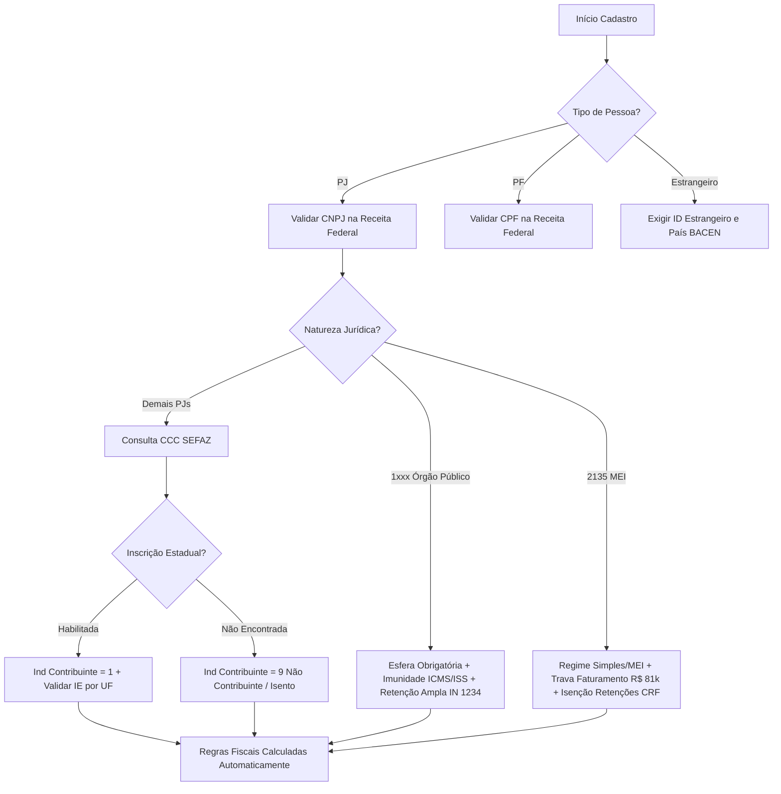

# 🏛️ Modelo Conceitual e Arquitetura de Dados Mestres de Parceiros de Negócio (Tax Business Partner)
**Compliance Fiscal:** SPED Fiscal (EFD ICMS/IPI), SPED Contribuições (PIS/COFINS), SCANC, EFD-Reinf, DCTFWeb e Reforma Tributária (IBS/CBS - LC 214/2025).  
**Aplicabilidade:** ERPs de Grande Porte (SAP S/4HANA BP, Oracle ERP Cloud, Microsoft Dynamics 365).

---

## 1. IDENTIFICAÇÃO E CLASSIFICAÇÃO

### 1.1 Entidade Central: `PARCEIRO_NEGOCIO`
| Campo | Tipo / Tamanho | Domínio / Regra | Obrigatoriedade | Descrição e Validação |
| :--- | :--- | :--- | :--- | :--- |
| `ID_PARCEIRO` | UUID / VARCHAR(36) | Chave Primária | Obrigatório | Identificador imutável do parceiro. |
| `TIPO_PESSOA` | VARCHAR(2) | `PJ` (Jurídica), `PF` (Física), `EX` (Estrangeiro) | Obrigatório | Define os blocos de validação subsequentes. |
| `CPF_CNPJ` | VARCHAR(14) | Alfanumérico (11 dígitos numéricos para PF ou **14 posições alfanuméricas para PJ**) | Obrigatório (PF/PJ) | Compatível com o **Novo CNPJ Alfanumérico (Portaria RFB nº 439/2024)**: 12 posições alfanuméricas (`[A-Z0-9]`) + 2 dígitos verificadores numéricos (`[0-9]`). Validação por Módulo 11 adaptado ASCII. |
| `CNPJ_RAIZ` | VARCHAR(8) | Alfanumérico (`[A-Z0-9]{8}`) | Obrigatório (PJ) | 8 primeiros caracteres do CNPJ (Base/Raiz). |
| `CNPJ_ORDEM` | VARCHAR(4) | Alfanumérico (`[A-Z0-9]{4}`) | Obrigatório (PJ) | 4 caracteres de ordem de filial (`0001` ou alfanumérico). |
| `CNPJ_DV` | VARCHAR(2) | Numérico (`[0-9]{2}`) | Obrigatório (PJ) | 2 dígitos verificadores calculados via algoritmo oficial RFB. |
| `ID_ESTRANGEIRO` | VARCHAR(20) | Alfanumérico | Obrigatório (EX) | Tax ID / VAT Number / Passaporte. |
| `RAZAO_SOCIAL` | VARCHAR(150) | Texto | Obrigatório | Razão Social Oficial na RFB / Nome Completo. |
| `NOME_FANTASIA` | VARCHAR(100) | Texto | Opcional | Nome comercial ou apelido. |
| `DATA_CONSTITUICAO_NASC` | DATE | Formato ISO AAAA-MM-DD | Opcional | Data de abertura (PJ) ou nascimento (PF). |
| `NATUREZA_JURIDICA` | VARCHAR(4) | Tabela Concla RFB (Ex: `2062`, `2054`, `2135`, `1015`) | Obrigatório (PJ) | Código de 4 dígitos da Natureza Jurídica. |
| `REGIME_TRIBUTARIO` | VARCHAR(2) | `01` - Simples Nacional<br>`02` - Simples Nacional (Excesso)<br>`03` - Lucro Presumido<br>`04` - Lucro Real<br>`05` - Imune/Isento<br>`06` - MEI | Obrigatório (PJ) | Regime tributário federal vigente na competência. |
| `ESFERA_PUBLICA` | VARCHAR(2) | `NA` (Não Aplicável), `FE` (Federal), `ES` (Estadual), `MU` (Municipal) | Obrigatório (se NJ = 1xxx) | Define imunidade e regras da IN RFB 1.234/2012. |
| `SEGMENTO_MERCADOLOGICO`| VARCHAR(3) | `IND` (Indústria), `COM` (Comércio), `SER` (Serviços), `CON` (Construção), `RUR` (Produtor Rural), `FIN` (Financeiro), `SAU` (Saúde), `EDU` (Educação) | Obrigatório | Direciona perfis de tributação e apropriação de crédito. |
| `CNAE_PRINCIPAL` | VARCHAR(7) | Numérico (Ex: `6201501`, `4711301`) | Obrigatório (PJ) | CNAE primário da empresa na Receita Federal. |
| `CNAES_SECUNDARIOS` | JSON Array | Lista de strings `["4712100", "4721102"]` | Opcional | CNAEs secundários para validação de retenções de serviços. |
| `SUFRAMA` | VARCHAR(9) | Numérico (9 dígitos) | Opcional | Inscrição SUFRAMA para desoneração ZFM/ALC. |
| `STATUS_CADASTRO` | VARCHAR(1) | `A` (Ativo), `I` (Inativo), `B` (Bloqueado/Suspenso) | Obrigatório | Status operacional do parceiro. |

### 1.2 Especificação Técnica: CNPJ Alfanumérico (Portaria RFB nº 439/2024)
A partir da vigência oficial da Receita Federal para novos cadastros (previsão 2026/2027), os CNPJs deixam de ser estritamente numéricos para comportar a expansão cadastral:
- **Estrutura Geral:** `14 caracteres` (sem máscara) e `18 caracteres` (com máscara `XX.XXX.XXX/XXXX-99`).
- **Posições 1 a 8 (`CNPJ_RAIZ`):** Aceita letras maiúsculas de `A` a `Z` e algarismos de `0` a `9`.
- **Posições 9 a 12 (`CNPJ_ORDEM` / Filial):** Aceita letras maiúsculas de `A` a `Z` e algarismos de `0` a `9` (ex: `/0001` ou `/00A1`).
- **Posições 13 e 14 (`CNPJ_DV`):** Permanecem estritamente **2 dígitos numéricos (`0` a `9`)**.
- **Cálculo do Dígito Verificador (Módulo 11 Ponderado Adaptado):**
  - O valor decimal de cada caractere alfanumérico corresponde ao seu código **`ASCII - 48`**:
    - `'0'` a `'9'` ➔ valores `0` a `9`
    - `'A'` ➔ valor `17` (ASCII 65 - 48)
    - `'B'` ➔ valor `18` (ASCII 66 - 48) ... `'Z'` ➔ valor `42` (ASCII 90 - 48).
  - Pesos aplicados: `5, 4, 3, 2, 9, 8, 7, 6, 5, 4, 3, 2` para o 1º DV e `6, 5, 4, 3, 2, 9, 8, 7, 6, 5, 4, 3, 2` para o 2º DV.
  - Regra de Resto: Se `Resto < 2` ➔ `DV = 0`; caso contrário, `DV = 11 - Resto`.
- **Impacto em Bancos de Dados & APIs:**
  - Proibido armazenar como tipo `BIGINT` ou `INTEGER`. Obrigatoriamente `VARCHAR(14)`.
  - Proibido usar filtros de frontend do tipo `value.replace(/\D/g, '')` para PJ. O filtro deve ser `value.toUpperCase().replace(/[^A-Z0-9]/g, '').slice(0, 14)`.

---

## 2. DADOS FISCAIS, TRIBUTÁRIOS E RETENÇÕES

### 2.1 Inscrições e Enquadramentos
| Campo | Tipo / Tamanho | Domínio / Regra | Validação & Impacto Fiscal |
| :--- | :--- | :--- | :--- |
| `INSCRICAO_ESTADUAL` | VARCHAR(14) | Numérico ou `ISENTO` | Validado via CCC SEFAZ por UF. Se não contribuinte, preencher `ISENTO` ou nulo. |
| `IND_IE_DESTINATARIO` | VARCHAR(1) | `1` - Contribuinte ICMS<br>`2` - Contribuinte Isento<br>`9` - Não Contribuinte | Fundamental para determinação de DIFAL Partilha (EC 87/2015) e CST de ICMS. |
| `INSCRICAO_MUNICIPAL` | VARCHAR(20) | Alfanumérico | Obrigatório se prestador/tomador de serviços no município. |
| `IND_CONTRIBUINTE_IPI` | BOOLEAN | `TRUE` / `FALSE` | Define obrigatoriedade de destaque de IPI ou suspensão (equiparação a industrial). |
| `IND_SUBSTITUTO_TRIB` | BOOLEAN | `TRUE` / `FALSE` | Indica se o parceiro possui regime especial de ST na UF de destino. |
| `IND_PRODUTOR_RURAL` | BOOLEAN | `TRUE` / `FALSE` | Habilita regras de Funrural, emissão de NF-e Avulsa e diferimento. |
| `IND_COOPERATIVA` | BOOLEAN | `TRUE` / `FALSE` | Regras de ato cooperativo (isenção PIS/COFINS e regras específicas de IRPJ/CSLL). |
| `IND_OPTANTE_SIMPLES` | BOOLEAN | `TRUE` / `FALSE` | Determina emissão com CSOSN e cálculo de crédito permitida (LC 123/2006). |
| `ALÍQUOTA_ICMS_SIMPLES`| DECIMAL(5,2) | Percentual (Ex: `2.84%`) | Percentual de crédito de ICMS informado no documento do Simples. |

### 2.2 Motor de Retenções na Fonte (Parceiro como Prestador/Fornecedor)
| Tributo Retido | Campo Indicador | Base Legal / Regra | Alíquota Padrão / Dispensa |
| :--- | :--- | :--- | :--- |
| **IRRF (Serviços)** | `RETEM_IRRF` (BOOLEAN) | RIR/2018 (Art. 714 / 647) | 1,5% (serviços profissionais) ou 1,0% (limpeza/segurança). Dispensa < R$ 10,00. |
| **PIS/COFINS/CSLL (CRF)**| `RETEM_CRF` (BOOLEAN) | Lei 10.833/2003 (Art. 30) | 4,65% (0,65% PIS + 3,0% COFINS + 1,0% CSLL). Não retém de optantes pelo Simples. |
| **INSS Retenção** | `RETEM_INSS` (BOOLEAN) | Lei 8.212/1991 (Art. 31) / IN RFB 2.110 | 11% (ou 3,5% com CPRB) sobre cessão de mão de obra / empreitada. |
| **ISS Retido na Fonte** | `RETEM_ISS` (BOOLEAN) | LC 116/2003 (Art. 3º e 6º) | 2,00% a 5,00% dependendo do local de incidência do serviço (CPOM/DDA). |
| **Órgãos Públicos** | `REGIME_RET_PUBLICA` | IN RFB 1.234/2012 | Retenção ampla combinada (IR + CSLL + PIS + COFINS) no pagamento. |

---

## 3. ENDEREÇAMENTO, OPERACIONAL E CONTÁBIL

### 3.1 Endereços Fiscais e Operacionais (`PARCEIRO_ENDERECO`)
- **Tipo de Endereço:** Fiscal (Faturamento), Cobrança, Entrega, Instalação.
- **Campos:** CEP, Logradouro, Número, Complemento, Bairro, Código Município IBGE (7 dígitos - obrigatório SPED/NF-e), Nome Município, UF, Código País BACEN (1058 para Brasil).
- **Indicador de Estabelecimento:** Matriz (`0001`), Filial (`0002+`).

### 3.2 Estrutura Contábil e Financeira (`PARCEIRO_FINANCEIRO`)
- **Conta Contábil Fornecedor / Cliente:** Código da conta no Plano de Contas referencial SPED (Registro 0500).
- **Centro de Custo / Lucro Default:** Roteamento analítico nos registros do SPED e ERP.
- **Condição de Pagamento:** Prazo médio, limite de crédito aprovado, bloqueio financeiro.
- **Dados Bancários:** Código Banco FEBRABAN (3 dígitos), Agência com DV, Conta Corrente com DV, Chave PIX (CPF, CNPJ, E-mail, EVP).
- **Contabilidade do Parceiro:** Nome do Contador, CRC com UF e E-mail fiscal para recebimento automático de XMLs de NF-e/CT-e/NFS-e.

---

## 4. OBRIGAÇÕES ACESSÓRIAS — MAPEAMENTO DETALHADO

### 4.1 EFD ICMS/IPI (SPED Fiscal)
| Registro SPED | Descrição Registro | Campo do Cadastro | Mapeamento no Registro |
| :--- | :--- | :--- | :--- |
| **0150** | Cadastro do Participante | `ID_PARCEIRO` | `COD_PART` (Código interno alfanumérico) |
| **0150** | Nome do Participante | `RAZAO_SOCIAL` | `NOME` |
| **0150** | Código do País | `COD_PAIS_BACEN` | `COD_PAIS` (1058 Brasil) |
| **0150** | CNPJ / CPF | `CPF_CNPJ` | `CNPJ` (14 dígitos) ou `CPF` (11 dígitos) |
| **0150** | Inscrição Estadual | `INSCRICAO_ESTADUAL` | `IE` (Formatado sem pontos/traços ou `ISENTO`) |
| **0150** | Código IBGE Município | `COD_MUNICIPIO_IBGE` | `COD_MUN` (7 dígitos) |
| **0150** | Suframa | `SUFRAMA` | `SUFRAMA` |
| **0150** | Endereço | `LOGRADOURO, NUM, BAIRRO`| `END`, `NUM`, `COMPL`, `BAIRRO` |
| **0170** | Tabela de Itens x Parceiro | `COD_PRODUTO_FORNECEDOR`| `COD_ITEM` correlacionado ao cadastro interno 0200 |
| **C100 / C190** | Indicador de Operação | `UF_PARCEIRO` vs `UF_EMPRESA` | Define CFOP `1xxx/2xxx/3xxx` (Entrada) ou `5xxx/6xxx/7xxx` (Saída) |

### 4.2 EFD Contribuições (SPED PIS/COFINS)
| Registro SPED | Descrição Registro | Campo do Cadastro | Mapeamento no Registro |
| :--- | :--- | :--- | :--- |
| **0150** | Cadastro do Participante | `ID_PARCEIRO`, `CNPJ/CPF` | `COD_PART`, `CNPJ`, `CPF`, `IE`, `COD_MUN` |
| **C100 / C170** | Itens da Nota | `REGIME_TRIBUTARIO` | Define CST PIS/COFINS (`50-66` Créditos Básicos, `70-75` Não Tributados) |
| **F500 / F550** | Consolidação de Receitas | `SEGMENTO_MERCADOLOGICO` | Identificação de receitas isentas, alíquota zero ou suspensão |

### 4.3 SCANC (Combustíveis & Biocombustíveis)
| Exigência SCANC | Campo do Cadastro | Validação Obrigatória |
| :--- | :--- | :--- |
| **Código de Agente ANP** | `COD_ANP_DISTRIBUIDOR` | Obrigatório para TRRs, Distribuidores e Refinarias. |
| **Inscrição Estadual com ST** | `IE_SUBST_TRIB_UF` | IE especial na UF de destino para recolhimento monofásico de ICMS/IBS. |
| **Rastreabilidade de Cupom/NFC-e** | `IND_CONSUMIDOR_FINAL` | Identifica se a venda de combustível é para consumo próprio ou revenda. |
| **Local de Entrega / Base** | `COD_BASE_DISTRIBUICAO`| Município IBGE e coordenadas georreferenciadas do ponto de descarga. |

### 4.4 EFD-Reinf & DCTFWeb
- **Tabela 01 (R-2010 / R-2020):** Retenção Previdenciária vinculada ao CNPJ do Prestador (`Cessão de Mão de Obra = TRUE`, indicando `Indicador de CPRB = 1`).
- **Tabela 40 (R-4010 / R-4020):** Pagamentos e retenções de IRRF e CRF (PIS/COFINS/CSLL) vinculados ao CPF/CNPJ e Natureza de Rendimento (`Ex: 17001 - Serviços Prestados por PJ`).

---

## 5. MATRIZ DE REGRAS DE NEGÓCIO & COMBINAÇÕES VÁLIDAS



### 5.1 Regras de Validação Automática e Bloqueios
1. **Regra de Incompatibilidade de Porte:**
   - Se `NATUREZA_JURIDICA == '2135'` (Empresário Individual / MEI), `REGIME_TRIBUTARIO` DEVE ser `06` (MEI) ou `01` (Simples).
   - Se `NATUREZA_JURIDICA == '2054'` (S/A Aberta) ou `2046` (S/A Fechada), `REGIME_TRIBUTARIO` NÃO pode ser `01` (Simples Nacional).
2. **Regra de Contribuinte de ICMS x IE:**
   - Se `IND_IE_DESTINATARIO == '1'`, o campo `INSCRICAO_ESTADUAL` é obrigatório, numérico e deve passar na validação de dígito verificador da UF correspondente.
   - Se `IND_IE_DESTINATARIO == '9'`, a `INSCRICAO_ESTADUAL` deve ser vazia ou nula.
3. **Regra de Retenção de CRF (Lei 10.833/03):**
   - Se o fornecedor for `REGIME_TRIBUTARIO == '01'` (Simples Nacional) ou `06` (MEI), o campo `RETEM_CRF` deve ser automaticamente desmarcado e travado como `FALSE`.
4. **Regra de Retenção de Órgãos Públicos:**
   - Se `ESFERA_PUBLICA in ('FE', 'ES', 'MU')`, habilitar automaticamente a tabela de retenções específicas da IN RFB 1.234/2012 e desabilitar destaque de ICMS próprio nas vendas para eles (isenção/não incidência por imunidade recíproca).

---

## 6. EXEMPLOS PRÁTICOS COMPLETOS DE CADASTRO

### Exemplo 1: PJ Indústria (Lucro Real)
```json
{
  "tipoPessoa": "PJ",
  "cnpj": "02.456.789/0001-30",
  "razaoSocial": "METALURGICA BRASIL S/A",
  "nomeFantasia": "METALBRAS",
  "naturezaJuridica": "2054",
  "regimeTributario": "04",
  "cnaePrincipal": "2511000",
  "segmento": "IND",
  "inscricaoEstadual": "110293847115",
  "indContribuinteIcms": "1",
  "indContribuinteIpi": true,
  "retemIrrf": true,
  "retemCrf": true,
  "retemInss": false,
  "endereco": {
    "logradouro": "Av. Industrial",
    "numero": "1500",
    "bairro": "Distrito Industrial",
    "codMunicipioIbge": "3550308",
    "municipio": "São Paulo",
    "uf": "SP",
    "cep": "04571000"
  },
  "sped": {
    "codPart": "FORN_002931",
    "planoContasRef": "2.01.01.01.001"
  }
}
```

### Exemplo 2: PJ Comércio (Simples Nacional)
```json
{
  "tipoPessoa": "PJ",
  "cnpj": "14.890.123/0001-45",
  "razaoSocial": "MERCADO POPULAR DE ALIMENTOS LTDA",
  "nomeFantasia": "MERCADINHO DA VILA",
  "naturezaJuridica": "2062",
  "regimeTributario": "01",
  "cnaePrincipal": "4711302",
  "segmento": "COM",
  "inscricaoEstadual": "140889234110",
  "indContribuinteIcms": "1",
  "indContribuinteIpi": false,
  "aliquotaIcmsSimples": 3.12,
  "retemIrrf": false,
  "retemCrf": false,
  "retemInss": false,
  "endereco": {
    "logradouro": "Rua das Flores",
    "numero": "250",
    "bairro": "Centro",
    "codMunicipioIbge": "3550308",
    "municipio": "São Paulo",
    "uf": "SP",
    "cep": "01001000"
  }
}
```

### Exemplo 3: Órgão Público Municipal (Prefeitura)
```json
{
  "tipoPessoa": "PJ",
  "cnpj": "46.395.000/0001-39",
  "razaoSocial": "MUNICIPIO DE SAO PAULO",
  "nomeFantasia": "PREFEITURA DE SAO PAULO",
  "naturezaJuridica": "1031",
  "esferaPublica": "MU",
  "regimeTributario": "05",
  "cnaePrincipal": "8411600",
  "segmento": "SER",
  "inscricaoEstadual": "ISENTO",
  "indContribuinteIcms": "9",
  "retemIrrf": true,
  "retemCrf": true,
  "regimeRetPublica": "IN_1234_AMPLA",
  "endereco": {
    "logradouro": "Viaduto do Chá",
    "numero": "15",
    "bairro": "Centro",
    "codMunicipioIbge": "3550308",
    "municipio": "São Paulo",
    "uf": "SP",
    "cep": "01002020"
  }
}
```

---

## 7. GOVERNANÇA, WORKFLOW E RECOMENDAÇÕES PARA ERPs

1. **Workflow de 4 Etapas (Data Quality Gate):**
   - **Solicitação:** Pré-cadastro via portal de fornecedores ou compras.
   - **Validação Fiscal Automatizada:** Webhook consulta Receita Federal (CNPJ/QSA/Simples) e CCC SEFAZ (Inscrição Estadual ativa/inapta).
   - **Aprovação Fiscal / MDM:** Equipe de Governança Fiscal valida regras de retenção e enquadramento de tributos.
   - **Ativação e Liberação Operacional:** Dados sincronizados com o motor de determinação de impostos do ERP (SAP Tax Engine / Vertex / Avalara / Thomson Reuters).

2. **Auditoria Contínua (Job Scheduler):**
   - Rotina periódica automática (a cada 15 dias) via API CCC SEFAZ para identificar se algum fornecedor ou cliente teve a IE cancelada, baixada ou suspensa, evitando bloqueios na emissão de NF-e e geração de autuações por notas emitidas para parceiros inaptos.
