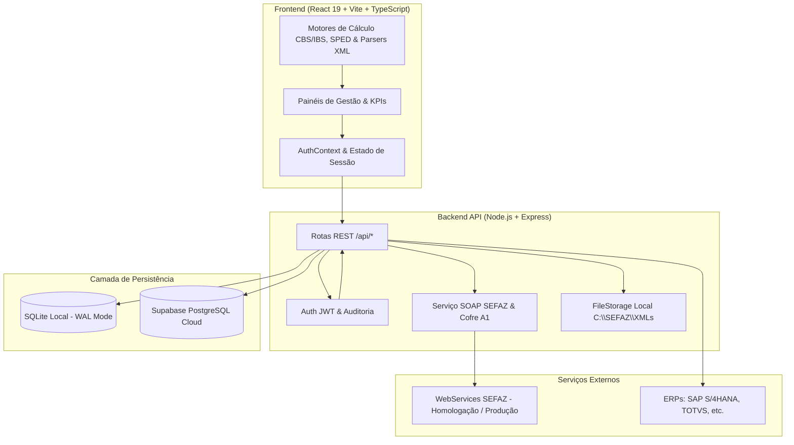

# 📖 Documentação Técnica Completa de Arquivos — Radar de Conformidade Fiscal

> **Sistema:** Radar de Conformidade Fiscal (v2.5.0)  
> **Objetivo:** Plataforma corporativa multi-tenant para captura contínua de DF-e na SEFAZ via NSU, auditoria fiscal automatizada, apuração de créditos e adequação às regras da Reforma Tributária (CBS/IBS/IS - LC 214/2025).  
> **Stack:** React 19, TypeScript, Vite, Tailwind CSS v4, Node.js, Express, SQLite (WAL local) / Supabase (PostgreSQL Cloud), SOAP SEFAZ, Criptografia AES-256-GCM / PKCS#12.

---

## 🗺️ Sumário Executivo da Arquitetura

O sistema é dividido em duas camadas principais altamente integradas:

---

## 1. Backend: Núcleo e Servidor (`server/`)

### 📄 `server/index.ts`
* **O que tem no código:**
  * Ponto de entrada (*entry point*) do servidor backend Node.js / standalone.
  * Inicialização síncrona/assíncrona do banco de dados SQLite local (`initializeSchema`, `seedDatabase`) e Supabase (`seedSupabaseDatabase`).
  * Configuração do servidor de arquivos estáticos para servir o bundle compilado do frontend React (`dist/`) em ambiente de produção com suporte a fallback de rotas SPA.
  * Inicialização do listener HTTP no host e porta configurados (`SERVER.PORT`, `SERVER.HOST`).
  * Tratamento de encerramento gracioso (*graceful shutdown*) capturando sinais `SIGINT` e `SIGTERM` para fechar conexões ativas com o banco.
* **Reflexo no sistema:**
  * Permite que a aplicação suba com um único comando (`npm start` ou `npm run start`), garantindo que todas as tabelas e dados mestres (como o usuário administrador padrão `admin@radarfiscal.com.br`) estejam prontos para uso antes do primeiro acesso.

---

### 📄 `server/app.ts`
* **O que tem no código:**
  * Criação e configuração da instância Express da aplicação.
  * Configuração de middlewares de segurança: `helmet` para proteção de headers HTTP e `cors` com suporte a credenciais e múltiplos métodos (`GET`, `POST`, `PUT`, `DELETE`, `PATCH`).
  * Parsers de corpo de requisição (`express.json({ limit: '10mb' })` e `urlencoded`) para suportar uploads pesados de XML e payloads de lote.
  * Registro de todas as rotas da API em prefixos dedicados (`/api/auth`, `/api/sefaz`, `/api/tables`, `/api/relatorios`, `/api/upload`, `/api/config`, `/api/tenants`, `/api/directories`, `/api/users`, `/api/audit`, `/api/partners`).
  * Endpoint de verificação de saúde (`GET /api/health`) e middlewares globais para captura de rotas não encontradas (404) e tratamento centralizado de exceções (500).
* **Reflexo no sistema:**
  * Define a estrutura de roteamento e segurança de toda a API REST consumida pelo frontend. Garante que qualquer requisição mal formatada ou rota inexistente seja tratada uniformemente com respostas JSON estruturadas.

---

### 📄 `server/config.ts`
* **O que tem no código:**
  * Centralização e tipagem de todas as variáveis de ambiente (`process.env`), com valores padrão e fallbacks inteligentes.
  * Objetos exportados: `SERVER` (porta, host, ambiente, cors), `AUTH` (segredo JWT, tempos de expiração, rounds do bcrypt), `DATABASE` (caminho do arquivo SQLite), `SEFAZ` (URLs dos WebServices SVRS para recepção de eventos, consulta de protocolo e distribuição de DF-e em Homologação e Produção, além do Portal Nacional da NFS-e), `CGIBS` (Comitê Gestor do IBS), `RFB` (Receita Federal), `ERP` (SAP S/4HANA / TOTVS), `CERTIFICADO` (diretório e chave AES-256 de criptografia), `RATE_LIMIT` e `SUPABASE` (URL, Anon Key e Service Role Key).
  * Geração automática em memória de chave de criptografia de 256 bits (`CERT_ENCRYPTION_KEY`) caso nenhuma esteja configurada.
* **Reflexo no sistema:**
  * Garante que toda a aplicação (rotas, serviços de criptografia e clientes SOAP) utilize configurações padronizadas. Permite alternar facilmente entre ambientes (desenvolvimento local, Docker, staging e produção no Render/Supabase) apenas alterando variáveis de ambiente.

---

## 2. Backend: Banco de Dados e Migrações (`server/db/`)

### 📄 `server/db/database.ts`
* **O que tem no código:**
  * Gerenciador de conexão com o banco SQLite local utilizando a biblioteca de alto desempenho `better-sqlite3`.
  * Criação automática do diretório de dados (`data/`) caso não exista.
  * Habilitação dos modos `journal_mode = WAL` (Write-Ahead Logging para leitura e escrita concorrente rápida), `foreign_keys = ON` e `busy_timeout = 5000`.
  * Mock/fallback defensivo para evitar quebras em ambientes que operem exclusivamente em nuvem (Supabase).
* **Reflexo no sistema:**
  * Fornece persistência ultrarrápida, local e transacional para estações de trabalho ou servidores locais, assegurando que o sistema funcione 100% offline ou sem dependência imediata de nuvem.

---

### 📄 `server/db/supabase.ts`
* **O que tem no código:**
  * Instanciação e controle do cliente oficial `@supabase/supabase-js`.
  * Função `isSupabaseConfigured()` para verificar dinamicamente se as credenciais do Supabase estão preenchidas no `.env`.
  * Função `getSupabaseAdmin()` que cria o cliente administrativo com `SERVICE_ROLE_KEY` (ignorando restrições automáticas de RLS para rotas internas do backend).
* **Reflexo no sistema:**
  * Habilita a operação em nuvem escalável. Sempre que o Supabase estiver configurado, as rotas do backend dão preferência ao PostgreSQL Cloud, viabilizando acesso distribuído multiusuário e deploy no Render/Vercel.

---

### 📄 `server/db/schema.ts`
* **O que tem no código:**
  * Definição completa do DDL (Data Definition Language) de todas as tabelas do sistema no SQLite:
    * `empresas`: Cadastro multi-tenant por CNPJ Raiz, razão social, UF, regime tributário, último NSU, max NSU e flag de manifestação automática de ciência.
    * `usuarios`: Usuários corporativos, senha criptografada em bcrypt, perfil de acesso (RBAC), campos de MFA (TOTP).
    * `usuario_empresa`: Tabela de associação para controle de permissões por empresa (total, escrita, leitura e módulos permitidos).
    * `sessoes`: Controle de sessões e refresh tokens JWT ativos.
    * `certificados`: Cofre seguro com metadados do certificado A1, validade, fingerprint SHA-256 e arquivo/senha criptografados em AES-256-GCM.
    * `diretorios_config`: Regras de salvamento e monitoramento de pastas por CNPJ Raiz.
    * `aliquotas_referencia`: Tabela de alíquotas de referência da Reforma Tributária (CBS, IBS, IS) por competência temporal e base legal.
    * `aliquotas_tabelas`: Alíquotas cadastrais ad valorem (%) e ad rem (R$/unidade).
    * `ncm_regras_anexos`: Mapeamento de NCM/NBS com tratamentos diferenciados (cesta básica, reduções de 60%/30%, isenção, etc.).
    * `cfop_tratamento`: Matriz de CFOPs e regras de apropriação de créditos.
    * `cclasstrib_regras`: Códigos de Classificação Tributária (cClassTrib) da Reforma Tributária.
    * `regras_elegibilidade`: Regras de negócio para determinação de elegibilidade a crédito fiscal.
    * `audit_log`: Trilha imutável de auditoria corporativa.
    * `eventos_transmitidos`: Histórico de eventos SEFAZ enviados e protocolos retornados.
    * `dfe_documentos` e `dfe_itens`: Armazenamento de documentos fiscais e respectivos itens/produtos extraídos dos XMLs.
  * Índices de performance (`CREATE INDEX`) e migrações seguras (`ALTER TABLE ... ADD COLUMN`) para bancos existentes.
* **Reflexo no sistema:**
  * Garante integridade referencial, relacionamentos consistentes e consultas indexadas ultrarrápidas em todas as telas de consulta, relatórios e auditoria.

---

### 📄 `server/db/seed.ts`
* **O que tem no código:**
  * População inicial (*seed*) de dados no banco SQLite local caso as tabelas estejam vazias.
  * Insere o usuário Admin mestre (`admin@radarfiscal.com.br`), empresas padrão de teste (matriz e filiais), vínculos de permissão, tabelas completas de alíquotas CBS/IBS (2026 a 2033), regras de NCM (LC 214/2025), matriz de CFOPs e códigos cClassTrib.
* **Reflexo no sistema:**
  * Permite que o sistema seja utilizado imediatamente após a instalação, sem necessidade de cadastros manuais exaustivos de alíquotas e tabelas tributárias da legislação.

---

### 📄 `server/db/seed_supabase.ts`
* **O que tem no código:**
  * Rotina assíncrona equivalente ao seed local, mas direcionada ao banco PostgreSQL no Supabase.
  * Cria o usuário administrador e empresas base se não existirem no Supabase.
* **Reflexo no sistema:**
  * Garante que instâncias recém-conectadas ao Supabase estejam configuradas com o acesso do administrador principal sem necessidade de scripts SQL manuais.

---

### 📄 `server/db/seed_xml.ts`
* **O que tem no código:**
  * Script utilitário para carregar dados de demonstração de documentos fiscais (`dfe_documentos` e `dfe_itens`) com notas fiscais de entrada e saída já formatadas com CBS e IBS para testes analíticos dos relatórios.
* **Reflexo no sistema:**
  * Auxilia em testes automatizados e demonstrações do sistema ao alimentar os relatórios com dados fiscais consistentes.

---

### 📄 `server/db/clear_xml.ts`
* **O que tem no código:**
  * Script simples de limpeza que executa `DELETE FROM dfe_itens` e `DELETE FROM dfe_documentos`.
* **Reflexo no sistema:**
  * Permite zerar a base de documentos fiscais importados para iniciar uma carga real e limpa de XMLs via SEFAZ ou upload em lote.

---

### 📄 `server/db/supabase_schema.sql` e `server/db/rls_policies.sql`
* **O que tem no código:**
  * Arquivos SQL contendo a definição completa das tabelas em PostgreSQL (DDL compatível com Supabase) e as políticas de segurança em nível de linha (*Row Level Security* - RLS).
  * Regras que restringem o acesso a registros de uma empresa apenas a usuários autorizados na tabela `usuario_empresa`.
* **Reflexo no sistema:**
  * Proteção de dados multi-tenant na nuvem, garantindo isolamento total entre empresas diferentes mesmo que compartilhem o mesmo banco de dados PostgreSQL.

---

## 3. Backend: Middleware e Utilitários (`server/middleware/`, `server/utils/`)

### 📄 `server/middleware/auth.ts`
* **O que tem no código:**
  * `requireAuth`: Middleware que intercepta as requisições HTTP, valida o token JWT presente no cabeçalho `Authorization: Bearer <token>`, decodifica os dados (`userId`, `email`, `perfil`, `empresaAtivaId`, `empresaCnpj`) e injeta no objeto `req.user`.
  * `requirePerfil(...perfisPermitidos)`: Middleware de RBAC que bloqueia usuários caso seu perfil não esteja na lista de perfis autorizados para a rota.
  * `logAuditAction`: Função utilitária que grava automaticamente uma ação no log de auditoria (`audit_log`), registrando IP, usuário, empresa, ação e payload adicional.
* **Reflexo no sistema:**
  * Impede acessos não autorizados em toda a API, protege operações críticas (como transmissão de eventos SEFAZ ou exclusão de regras) e mantém uma trilha de auditoria para conformidade e compliance (LGPD e normas contábeis).

---

### 📄 `server/utils/fileStorage.ts`
* **O que tem no código:**
  * Função `salvarXmlLocalmente(xmlContent, cnpjRaiz, tipoOperacao, dataEmissaoIso, chaveAcesso)`.
  * Extrai ano e mês da data de emissão do XML.
  * Monta e cria de forma recursiva e automática a árvore de pastas padronizada no disco:
    `C:\SEFAZ\XMLs\[CNPJ_RAIZ]\[Entrada|Saida]\[Ano]\[Mês]\[chaveAcesso].xml`.
  * Grava o conteúdo físico do arquivo XML em disco com tratamento seguro de erros.
* **Reflexo no sistema:**
  * Mantém o repositório local de arquivos XML perfeitamente estruturado, organizado e indexado cronologicamente, facilitando a localização de arquivos para auditorias ou integração com sistemas fiscais legados.

---

## 4. Backend: Serviços Especializados (`server/services/`)

### 📄 `server/services/sefazService.ts`
* **O que tem no código:**
  * Motor de comunicação SOAP com os WebServices da SEFAZ Nacional e SVRS.
  * Mapeamento de códigos IBGE das Unidades Federativas (`UF_TO_CUF`).
  * Descriptografia em tempo de execução do certificado digital A1 (.pfx) em memória usando `node-forge` e `crypto` (AES-256-GCM), criando o `https.Agent` com a chave privada e certificado cliente TLS.
  * Implementação da distribuição de DF-e (`NFeDistribuicaoDFe`):
    * Envio de envelope SOAP para consulta por último NSU (`ultNSU`), NSU específico ou Chave de Acesso (`chNFe`).
    * Descompressão automática de documentos retornados em formato GZIP Base64 (`<docZip>`).
    * Extração e parseamento dos schemas (`procNFe`, `resNFe`, `resEvento`, `procEventoNFe`).
    * Manifestação automática de Ciência da Operação (`210210`) para documentos sumarizados (`resNFe`), permitindo que a SEFAZ libere o XML completo na consulta subsequente.
    * Salvamento físico automático do XML via `salvarXmlLocalmente` e persistência nos bancos local/Supabase.
  * Implementação do envio de Eventos Fiscais (`NFeRecepcaoEvento4`):
    * Montagem do XML canônico do evento com assinatura digital XML-DSig (digest SHA-1 e RSA).
    * Envio do lote de evento e tratamento do código de retorno `cStat` (ex: 135 - Evento homologado).
* **Reflexo no sistema:**
  * É o coração da automação fiscal do sistema. Elimina a necessidade de intervenção humana para baixar notas fiscais emitidas contra o CNPJ da empresa, mantendo o repositório de XMLs e a base de dados sincronizados em tempo real diretamente com a SEFAZ.

---

## 5. Backend: Rotas da API REST (`server/routes/`)

### 📄 `server/routes/auth.ts`
* **O que tem no código:**
  * `POST /api/auth/login`: Autentica usuário com validação de senha via `bcrypt.compareSync`, busca as empresas às quais o usuário tem acesso e gera o token JWT contendo a empresa ativa inicial.
  * `POST /api/auth/trocar-empresa`: Permite ao usuário alternar sua empresa ativa sem precisar deslogar, gerando um novo token JWT com os dados da nova filial/matriz.
  * `POST /api/auth/refresh`: Atualização de token de acesso expirado.
  * `GET /api/auth/me`: Retorna os dados do usuário autenticado e lista de empresas vinculadas.
  * `POST /api/auth/logout`: Revoga a sessão ativa.
* **Reflexo no sistema:**
  * Garante o login seguro e a navegação multi-empresa fluida no topo da interface.

---

### 📄 `server/routes/sefaz.ts`
* **O que tem no código:**
  * `POST /api/sefaz/distribuicao-dfe`: Rota acionada pelo modal de consulta NSU para sincronizar lotes de notas fiscais da SEFAZ.
  * `POST /api/sefaz/transmitir-evento`: Transmite eventos (Ciência, Confirmação, Desconhecimento, Cancelamento, CC-e, Ajustes da Reforma) para a SEFAZ.
  * `GET /api/sefaz/eventos`: Retorna o histórico de eventos transmitidos com filtros por chave de acesso ou período.
  * `GET /api/sefaz/status-servico`: Testa a conectividade com o WebService da SEFAZ.
* **Reflexo no sistema:**
  * Dá vida aos painéis de Captura de DF-e e Transmissão de Eventos, conectando a interface gráfica aos WebServices fiscais do governo.

---

### 📄 `server/routes/upload.ts`
* **O que tem no código:**
  * `POST /api/upload/xml`: Recebe conteúdo de arquivos XML (enviados individualmente ou em lote via drag-and-drop), realiza o parseamento completo de tags (chaves, emitente, destinatário, itens de produtos, NCM, CFOP, cClassTrib, bases e alíquotas de IBS/CBS/ICMS/PIS/COFINS), grava o arquivo físico no disco (`salvarXmlLocalmente`) e persiste nas tabelas `dfe_documentos` e `dfe_itens`.
* **Reflexo no sistema:**
  * Permite que o usuário faça a carga rápida de centenas de notas fiscais já existentes em seus diretórios locais diretamente para o banco de dados do sistema.

---

### 📄 `server/routes/relatorios.ts`
* **O que tem no código:**
  * `GET /api/relatorios/xml`: Realiza consultas analíticas com filtros avançados (período, emitente, destinatário, modelo, CFOP, cClassTrib, termo de busca) fazendo `JOIN` entre documentos fiscais e seus itens.
* **Reflexo no sistema:**
  * Fornece os dados brutos consolidados que alimentam os 8 relatórios especializados de conformidade e auditoria fiscal da Reforma Tributária.

---

### 📄 `server/routes/tables.ts`
* **O que tem no código:**
  * Endpoints de CRUD completo (`GET`, `POST`, `PUT`, `DELETE`) para todas as tabelas fiscais e paramétricas:
    * `/api/tables/aliquotas-referencia`
    * `/api/tables/aliquotas-tabelas`
    * `/api/tables/ncm-regras`
    * `/api/tables/cfop-tratamento`
    * `/api/tables/cclasstrib-regras`
    * `/api/tables/regras-elegibilidade`
* **Reflexo no sistema:**
  * Permite aos analistas fiscais e contadores customizarem e atualizarem alíquotas, exceções tributárias e regras de apropriação de crédito sem necessidade de alterações no código-fonte.

---

### 📄 `server/routes/partners.ts`
* **O que tem no código:**
  * Gerenciamento completo do Cadastro Mestre de Parceiros de Negócios (fornecedores, clientes e transportadoras).
  * Cadastro de CNPJ/CPF, Inscrição Estadual, regime tributário, avaliação de risco fiscal e elegibilidade de crédito CBS/IBS.
* **Reflexo no sistema:**
  * Alimenta o painel de Parceiros de Negócio, permitindo classificar fornecedores idôneos e identificar fornecedores inaptos que impedem a apropriação de créditos.

---

### 📄 `server/routes/tenants.ts`
* **O que tem no código:**
  * Endpoints para listar, cadastrar, atualizar e remover empresas/tenants (matrizes e filiais).
  * Atualização de configurações como `manifestar_ciencia_automatica`, `ultimo_nsu` e dados do contador (SPED 0100).
* **Reflexo no sistema:**
  * Alimenta a gestão da Carteira de CNPJs no frontend, controlando quais empresas estão sob gestão fiscal.

---

### 📄 `server/routes/certificates.ts`
* **O que tem no código:**
  * `POST /api/config/certificate/upload`: Recebe arquivo `.pfx` / `.p12`, senha do certificado e CNPJ associado.
  * Valida a senha do certificado em memória, extrai a validade, emissor e fingerprint SHA-256 via `node-forge`.
  * Criptografa o arquivo e a senha usando AES-256-GCM antes de gravar no disco e no banco.
  * `GET /api/config/certificate`: Retorna o status e dias restantes para expiração do certificado da empresa ativa (sem expor a senha).
* **Reflexo no sistema:**
  * Oferece um cofre seguro de certificados digitais, avisando visualmente o usuário quando o certificado estiver próximo de expirar e garantindo autenticação TLS nas chamadas SEFAZ.

---

### 📄 `server/routes/credentials.ts`
* **O que tem no código:**
  * Configuração de credenciais de integração com APIs governamentais (CGIBS, RFB) e sistemas de ERP (SAP, TOTVS).
* **Reflexo no sistema:**
  * Permite configurar chaves de API e webhooks para exportação e importação de dados com o ecossistema corporativo.

---

### 📄 `server/routes/directories.ts`
* **O que tem no código:**
  * Gerenciamento das configurações de pastas de monitoramento de XML por CNPJ Raiz (`diretorios_config`).
* **Reflexo no sistema:**
  * Permite ao usuário configurar quais diretórios de rede ou pastas locais o sistema deve monitorar para organizar arquivos de entrada e saída.

---

### 📄 `server/routes/users.ts`
* **O que tem no código:**
  * Gestão de usuários corporativos, controle de perfis RBAC, vinculação a empresas e bloqueio/desbloqueio de contas.
* **Reflexo no sistema:**
  * Alimenta o painel de Acesso Corporativo, permitindo ao administrador gerenciar a equipe fiscal.

---

### 📄 `server/routes/audit.ts`
* **O que tem no código:**
  * `GET /api/audit/logs`: Consulta paginada e filtrada dos registros da tabela `audit_log`.
* **Reflexo no sistema:**
  * Alimenta a tela de Observabilidade e Auditoria, permitindo rastrear quem realizou cada operação no sistema.

---

## 6. Frontend: Núcleo, Tipos e Estado Global (`src/`, `src/contexts/`, `src/hooks/`)

### 📄 `src/main.tsx`
* **O que tem no código:**
  * Ponto de entrada do frontend React 19.
  * Monta a árvore de componentes com o `AuthProvider` no elemento `#root` do DOM (`index.html`).
* **Reflexo no sistema:**
  * Inicializa a aplicação React no navegador do usuário e injeta o contexto de autenticação global.

---

### 📄 `src/App.tsx`
* **O que tem no código:**
  * Componente raiz da interface do usuário.
  * Gerencia o estado de navegação principal (`activeMode`) persistido no `localStorage` (`@RadarFiscal:activeMode`).
  * Controla a exibição condicional do componente de `Login` (quando não autenticado) ou do painel ativo selecionado no menu superior (`Header`):
    * `central_kpis`: Dashboard Executivo
    * `carteira_cnpjs`: Gestão de Tenants e Filiais
    * `parceiros_negocio`: Cadastro de Fornecedores e Clientes
    * `tabelas_fiscais`: Tabelas Tributárias CBS/IBS
    * `dfe_xml`: Gestor de Documentos Fiscais
    * `eventos_dfe`: Transmissor de Eventos SEFAZ
    * `relatorios_xml`: Central de Relatórios da Reforma Tributária
    * `auditoria_fiscal`: Painel de Auditoria e Inconsistências
    * `cruzamento_sped`: Cruzamento XML vs EFD SPED
    * `integracao_erp`: Conectores ERP / Webhooks
    * `observabilidade_dlq`: Logs e Fila de Retentativas
    * `lote` / `avulsa`: Consulta de Situação Cadastral de CNPJs
  * Controla os modais globais (`ConsultaNsuModal`, `ConfigDiretorioModal`, `AcessoCorporativoModal`, `DetalhesModal`).
  * Renderiza a barra inferior de status (`StatusBar`) e a gaveta lateral do certificado (`SidebarCertificado`).
* **Reflexo no sistema:**
  * É o orquestrador principal de toda a experiência visual do usuário, integrando todos os módulos e mantendo a consistência dos estados da aplicação.

---

### 📄 `src/types.ts`
* **O que tem no código:**
  * Arquivo central de tipagens TypeScript de todo o ecossistema frontend:
    * `QueryMode`, `PerfilUsuario`, `UsuarioCorporativo`, `ClienteEmpresaTenant`, `CertificadoA1`.
    * Modelos de documentos: `DfeXmlItem`, `DfeItemProduto`, `DfeEventoHistorico`, `DanfeData`.
    * Modelos de tabelas tributárias: `AliquotaReferencia`, `RegraNcmAnexo`, `CfopTratamento`, `CClassTribRegra`, `RegraElegibilidadeCredito`.
    * Modelos de auditoria e relatórios analíticos: `RelatorioRazaoItem`, `InconsistenciaFiscal`, `SpedCruzamentoResult`, `KpiData`.
* **Reflexo no sistema:**
  * Fornece segurança de tipos em tempo de compilação (*strict type checking*), autocompletar inteligente no editor e prevenção de erros de propriedade em todos os componentes.

---

### 📄 `src/index.css`
* **O que tem no código:**
  * Importação e configuração do Tailwind CSS v4 (`@import "tailwindcss";`).
  * Estilos utilitários globais, customização de barras de rolagem (*scrollbars* finas), classes para animações suaves de transição e regras de impressão para DANFE.
* **Reflexo no sistema:**
  * Garante o visual moderno, responsivo, limpo e profissional de toda a interface, tanto em modo claro quanto em telas de visualização e impressão de documentos.

---

### 📄 `src/contexts/AuthContext.tsx`
* **O que tem no código:**
  * Contexto React (`AuthContext`) e hook customizado `useAuth()`.
  * Gerencia o estado do usuário logado, token JWT, lista de empresas autorizadas e empresa atualmente ativa.
  * Funções: `login(email, senha)`, `logout()`, `selecionarEmpresa(empresaId)`, `verificarPermissao(modulo)`.
  * Persistência do token e empresa no `localStorage` com restauração automática de sessão ao recarregar a página.
* **Reflexo no sistema:**
  * Garante que toda a aplicação saiba qual usuário e empresa estão ativos no momento, sincronizando automaticamente o cabeçalho das requisições com o token JWT correspondente.

---

### 📄 `src/hooks/useApi.ts`
* **O que tem no código:**
  * Hook customizado que encapsula o `fetch` nativo com tratamento automático de headers de autorização (`Bearer <token>`), tratamento de erros e conversão de respostas JSON.
  * Métodos exportados: `get`, `post`, `put`, `deleteRequest`, `uploadFile`.
  * Tratamento de logout automático caso a API retorne código 401 (token expirado).
* **Reflexo no sistema:**
  * Padroniza e simplifica todas as chamadas HTTP dos componentes para o backend, evitando código repetitivo de cabeçalhos e tratamento de erros.

---

## 7. Frontend: Utilitários e Motores de Negócio (`src/utils/`)

### 📄 `src/utils/apiConfig.ts`
* **O que tem no código:**
  * Função `getApiBaseUrl()` que resolve a URL base da API dependendo do ambiente (porta 3001 em desenvolvimento local ou caminho relativo `/api` em produção).
* **Reflexo no sistema:**
  * Permite que o frontend se comunique perfeitamente com o backend sem necessidade de reconfiguração manual ao trocar de ambiente.

---

### 📄 `src/utils/xmlParser.ts`
* **O que tem no código:**
  * Parser robusto em TypeScript puro capaz de extrair todas as informações de arquivos XML de NF-e (modelos 55 e 65), CT-e (modelo 57) e NFS-e.
  * Extrai: chave de acesso de 44 dígitos, número, série, datas, dados completos do emitente e destinatário, itens individuais com suas respectivas tags tributárias (ICMS, IPI, PIS, COFINS, CBS, IBS, IS, cClassTrib), valores de frete, seguro, descontos, duplicatas/faturas e informações adicionais do fisco.
  * Gera objetos estruturados prontos para renderização em tela e no DANFE.
* **Reflexo no sistema:**
  * Possibilita a visualização instantânea de qualquer XML arrastado para a tela ou baixado da SEFAZ, sem dependência de APIs externas para leitura do XML.

---

### 📄 `src/utils/cnpj.ts`
* **O que tem no código:**
  * Funções de validação de dígitos verificadores de CNPJ e CPF.
  * Funções de máscara e formatação (`formatCNPJ`, `formatCPF`, `onlyNumbers`).
  * Motor de consulta de situação cadastral com suporte a rate limiting e circuit breaker para chamadas públicas à Receita Federal e Sintegra.
* **Reflexo no sistema:**
  * Garante que nenhum CNPJ inválido seja cadastrado ou pesquisado e viabiliza as consultas cadastrais individuais e em lote.

---

### 📄 `src/utils/excel.ts`
* **O que tem no código:**
  * Utilitários baseados na biblioteca `xlsx` para importação e exportação de planilhas Excel (`.xlsx`, `.xls`, `.csv`).
  * `parseExcelFile`: Lê planilhas com listas de CNPJs ou dados contábeis.
  * `exportToExcel`: Exporta qualquer tabela ou relatório analítico para Excel com cabeçalhos formatados e nomes de arquivo com data/hora.
* **Reflexo no sistema:**
  * Permite aos usuários extrair relatórios completos para Excel com um único clique em todas as tabelas do sistema.

---

### 📄 `src/utils/dfeEventsCatalog.ts`
* **O que tem no código:**
  * Catálogo completo de todos os eventos fiscais da SEFAZ:
    * Manifestação do Destinatário: Ciência da Emissão (210210), Confirmação da Operação (210200), Desconhecimento (210220), Operação Não Realizada (210240).
    * Eventos do Emitente: Cancelamento (110111), Carta de Correção Eletrônica - CC-e (110110), EPEC (110140).
    * Eventos da Reforma Tributária: Ajuste de CBS/IBS (110190), Estorno de Crédito (110191), Registro de Imobilizado (110192).
  * Define descrições, justificativas padrão e obrigatoriedade de campos para cada evento.
* **Reflexo no sistema:**
  * Alimenta as opções do painel de Transmissão de Eventos, garantindo que o usuário escolha o código correto com as regras exigidas pela SEFAZ.

---

### 📄 `src/utils/reformaTransicao.ts`
* **O que tem no código:**
  * Motor de regras de transição da Reforma Tributária (período 2026 a 2033).
  * Regras de alíquotas de teste de 2026 (0,9% CBS + 0,1% IBS), compensação com PIS/COFINS em 2027, e a redução gradual do ICMS/ISS contra a subida do IBS até 2033.
  * Cálculo de Split Payment e projeção de impacto financeiro no fluxo de caixa da empresa.
* **Reflexo no sistema:**
  * Permite aos gestores tributários simularem com exatidão o custo tributário e os créditos esperados em cada ano da transição da Reforma.

---

### 📄 `src/utils/auditoriaCredito.ts`
* **O que tem no código:**
  * Algoritmos de verificação automática de conformidade fiscal:
    * Validação cruzada de CFOP vs cClassTrib.
    * Verificação de fornecedores inaptos ou não contribuintes gerando créditos indevidos.
    * Detecção de alíquotas divergentes em relação às tabelas oficiais da LC 214/2025.
    * Identificação de notas de entrada sem manifesto após o prazo legal.
* **Reflexo no sistema:**
  * Alimenta o painel de Auditoria Fiscal com alertas automáticos de riscos e oportunidades de créditos fiscais não aproveitados.

---

### 📄 `src/utils/spedCruzamento.ts`
* **O que tem no código:**
  * Parser de arquivos texto do SPED Fiscal (EFD ICMS/IPI - Registros C100/C170 e EFD Contribuições - Registros C100/C170/A100).
  * Motor de comparação cruzada: compara cada nota do SPED contra o repositório de XMLs capturados na SEFAZ, apontando: notas faltantes na escrituração, notas no SPED sem XML correspondente e divergências de valores de base/imposto.
* **Reflexo no sistema:**
  * Permite auditoria prévia antes do envio do SPED para a Receita Federal, evitando autuações fiscais por divergência entre XML e EFD.

---

### 📄 `src/utils/reportsData.ts`
* **O que tem no código:**
  * Funções agregadoras de dados para relatórios: soma de bases de cálculo, segregação de créditos por UF, consolidação por NCM e agrupamento por CFOP.
* **Reflexo no sistema:**
  * Transforma a lista de itens de produtos em resumos analíticos e gráficos visuais nos relatórios.

---

### 📄 `src/utils/erpConnectors.ts`
* **O que tem no código:**
  * Adaptadores e formatadores de dados para integração com sistemas de gestão corporativa (SAP S/4HANA via BAPI/OData, TOTVS Protheus via REST e Webhooks genéricos).
* **Reflexo no sistema:**
  * Possibilita o envio de notas capturadas da SEFAZ diretamente para a fila de entrada do ERP da empresa.

---

### 📄 `src/utils/circuitBreaker.ts`
* **O que tem no código:**
  * Implementação do padrão de resiliência *Circuit Breaker* para chamadas de rede externas (SEFAZ e APIs de consulta).
  * Monitora taxas de erro: caso a SEFAZ fique instável, o circuito se abre temporariamente para proteger o sistema contra bloqueios por excesso de requisições (*rate limiting* / bloqueio por consumo indevido).
* **Reflexo no sistema:**
  * Evita que a empresa receba o código de rejeição `656 - Consumo Indevido` da SEFAZ durante momentos de instabilidade do fisco.

---

## 8. Frontend: Componentes e Painéis Principais (`src/components/`)

### 📄 `src/components/Header.tsx`
* **O que tem no código:**
  * Barra de navegação superior fixa com logotipo do sistema, seletor de empresa/filial ativa, badge de ambiente (Homologação / Produção), botões de atalho rápido (Consulta NSU, Configurar Pastas, Acesso Corporativo) e menu de usuário com logout.
* **Reflexo no sistema:**
  * Oferece navegação consistente e acesso rápido às principais funções do sistema a partir de qualquer tela.

---

### 📄 `src/components/StatusBar.tsx`
* **O que tem no código:**
  * Barra de rodapé com indicadores em tempo real: status de conexão com o backend, ambiente SEFAZ selecionado, empresa ativa e status do motor de captura em segundo plano.
* **Reflexo no sistema:**
  * Garante visibilidade constante do estado operacional do sistema.

---

### 📄 `src/components/SidebarCertificado.tsx`
* **O que tem no código:**
  * Gaveta lateral para visualização e upload de Certificado Digital A1 (.pfx).
  * Exibe razão social, CNPJ, validade, dias restantes com barra de progresso colorida e botão para testar a comunicação com a SEFAZ.
* **Reflexo no sistema:**
  * Permite ao usuário manter seus certificados atualizados e monitorar visualmente o risco de expiração.

---

### 📄 `src/components/Login.tsx`
* **O que tem no código:**
  * Tela de autenticação moderna com campos de e-mail e senha, suporte a visualização de senha, mensagens de erro estilizadas e preenchimento de credenciais padrão para demonstração.
* **Reflexo no sistema:**
  * Porta de entrada segura para o sistema.

---

### 📄 `src/components/CentralKpisPanel.tsx`
* **O que tem no código:**
  * Painel de KPIs Executivos com cartões de indicadores-chave: total de documentos capturados no mês, valor total de compras, volume de créditos apurados de CBS e IBS, taxa de conformidade fiscal e quantidade de pendências.
  * Gráficos comparativos e lista de ações rápidas recomendadas.
* **Reflexo no sistema:**
  * Oferece uma visão panorâmica e estratégica imediata da saúde fiscal da empresa para diretores e gerentes tributários.

---

### 📄 `src/components/CarteiraCnpjsPanel.tsx`
* **O que tem no código:**
  * Gestão completa da carteira de empresas e filiais do grupo econômico ou escritório contábil.
  * Cadastro de novos CNPJs, preenchimento de dados cadastrais (CNAE, Inscrição Estadual, regime tributário, dados do contador para o SPED 0100), controle da chave de **Manifestação Automática de Ciência da Operação** e acompanhamento do último NSU sincronizado.
* **Reflexo no sistema:**
  * Centraliza o cadastro multi-empresa e configura como a captura da SEFAZ deve se comportar para cada filial.

---

### 📄 `src/components/ParceirosNegocioPanel.tsx`
* **O que tem no código:**
  * Gestão do Cadastro Mestre de Parceiros Fiscais (fornecedores, clientes e transportadores).
  * Filtros por situação cadastral na Receita/Sintegra, classificação de risco fiscal e análise de impacto na tomada de créditos CBS/IBS.
* **Reflexo no sistema:**
  * Permite antecipar riscos de compras efetuadas com fornecedores inaptos ou suspensos no fisco.

---

### 📄 `src/components/TabelasFiscaisPanel.tsx`
* **O que tem no código:**
  * Interface com abas para visualização e edição das tabelas tributárias da Reforma:
    1. Alíquotas de Referência CBS/IBS por vigência legal.
    2. Alíquotas Ad Valorem e Ad Rem.
    3. Regras de NCM / Anexos (reduções e isenções).
    4. Matriz de CFOP x Tratamento de Crédito.
    5. Matriz de cClassTrib x Alíquotas.
    6. Regras Paramétricas de Elegibilidade de Crédito.
* **Reflexo no sistema:**
  * Dá total autonomia para a equipe tributária parametrizar as regras de cálculo sem depender de desenvolvedores.

---

### 📄 `src/components/DfeManagerPanel.tsx`
* **O que tem no código:**
  * Gerenciador e explorador de documentos fiscais (NF-e, CT-e, NFS-e).
  * Upload de arquivos XML em lote por arrastar e soltar (*drag and drop*).
  * Filtros avançados por período, tipo de operação (Entrada/Saída), emitente, destinatário e chave.
  * Botões de ação para cada documento: Visualizar XML estruturado, Abrir DANFE visual para impressão, Transmitir Evento e Consultar Protocolo na SEFAZ.
* **Reflexo no sistema:**
  * É a tela operacional diária do analista fiscal para consulta, conferência e manuseio de notas fiscais.

---

### 📄 `src/components/EventosDfePanel.tsx`
* **O que tem no código:**
  * Painel de transmissão e histórico de Eventos Eletrônicos da SEFAZ.
  * Formulário interativo para envio de Manifestação do Destinatário (Ciência, Confirmação, Desconhecimento, Operação Não Realizada), Cancelamento e Carta de Correção.
  * Tabela com histórico de eventos transmitidos com status, código cStat e protocolo retornado pelo fisco.
* **Reflexo no sistema:**
  * Garante a segurança jurídica da empresa ao permitir manifestar eventos e registrar confirmações de recebimento na SEFAZ com validade legal.

---

### 📄 `src/components/ConsultaNsuModal.tsx`
* **O que tem no código:**
  * Modal avançado de sincronização de notas fiscais via WebService `NFeDistribuicaoDFe` da SEFAZ.
  * Permite consulta em lote a partir do último NSU, consulta por NSU específico ou consulta por Chave de Acesso.
  * Opção de manifestação de ciência automática integrada para liberação de XMLs completos.
  * Log visual em tempo real das requisições SOAP e progresso de captura.
* **Reflexo no sistema:**
  * Permite baixar dezenas ou centenas de notas fiscais diretamente da SEFAZ com um único clique, salvando-as no disco e no banco de dados.

---

### 📄 `src/components/DanfeModal.tsx`
* **O que tem no código:**
  * Visualizador e gerador de DANFE (Documento Auxiliar da Nota Fiscal Eletrônica) em alta fidelidade.
  * Renderiza layout oficial com código de barras, dados do emitente, destinatário, cálculo do imposto, transportador, dados dos produtos/serviços, cálculo do ISSQN e dados adicionais.
  * Suporte nativo para impressão direta e download em PDF formatado.
* **Reflexo no sistema:**
  * Permite visualizar e imprimir o espelho oficial da nota fiscal a partir de qualquer XML armazenado, sem necessidade de softwares externos.

---

### 📄 `src/components/XmlViewerModal.tsx`
* **O que tem no código:**
  * Modal para inspeção técnica e detalhada do XML.
  * Exibe árvore de tags formatada com destaque de sintaxe, resumo dos itens e botão para cópia ou download do arquivo `.xml` bruto.
* **Reflexo no sistema:**
  * Facilita a análise técnica e fiscal de tags específicas da nota.

---

### 📄 `src/components/SplitPaymentModal.tsx`
* **O que tem no código:**
  * Modal simulador do mecanismo de *Split Payment* da Reforma Tributária.
  * Calcula o valor líquido a ser repassado ao fornecedor e o valor retido automaticamente para quitação de CBS e IBS no momento do pagamento financeiro.
* **Reflexo no sistema:**
  * Apoia a equipe de tesouraria e contas a pagar no planejamento financeiro sob as novas regras tributárias.

---

### 📄 `src/components/ErpIntegrationPanel.tsx`
* **O que tem no código:**
  * Painel de monitoramento das integrações com ERPs (SAP S/4HANA, TOTVS, Senior, Oracle).
  * Exibe status dos webhooks, fila de sincronização de notas e logs de comunicação.
* **Reflexo no sistema:**
  * Garante que os documentos capturados pelo Radar fluam automaticamente para o ERP contábil da organização.

---

### 📄 `src/components/SpedCruzamentoPanel.tsx`
* **O que tem no código:**
  * Painel de cruzamento automatizado entre arquivos do SPED Fiscal e os XMLs armazenados.
  * Realiza upload do arquivo `.txt` do SPED, processa os blocos C e compara nota a nota, exibindo uma tabela de divergências (notas não escrituradas, valores divergentes).
* **Reflexo no sistema:**
  * Previne contingências fiscais e multas por erros no preenchimento das obrigações acessórias.

---

### 📄 `src/components/AuditoriaFiscalPanel.tsx`
* **O que tem no código:**
  * Painel de auditoria fiscal automatizada contínua.
  * Lista todas as inconsistências identificadas pelo motor de regras, classificadas por gravidade (Crítico, Alerta, Oportunidade).
* **Reflexo no sistema:**
  * Transforma o setor fiscal de uma postura reativa para uma postura proativa de conformidade e recuperação de créditos.

---

### 📄 `src/components/ObservabilidadeDlqPanel.tsx`
* **O que tem no código:**
  * Painel técnico de observabilidade, Dead Letter Queue (DLQ) e logs de execução.
  * Exibe requisições que falharam, status do Circuit Breaker e permite reprocessar tarefas com erro.
* **Reflexo no sistema:**
  * Facilita o diagnóstico técnico e a recuperação de falhas de comunicação sem perda de dados.

---

### 📄 `src/components/ConfigDiretorioModal.tsx`
* **O que tem no código:**
  * Modal para configuração dos caminhos de armazenamento físico de XML no servidor/disco local para cada CNPJ Raiz.
* **Reflexo no sistema:**
  * Permite customizar onde os arquivos de entrada, saída e eventos são salvos na máquina ou servidor.

---

### 📄 `src/components/AcessoCorporativoModal.tsx`
* **O que tem no código:**
  * Modal para cadastro e gerenciamento de usuários do sistema, definição de perfis (Admin, Contador, Analista, Auditor) e restrição de acesso por empresa.
* **Reflexo no sistema:**
  * Garante governança corporativa e controle de permissões.

---

### 📄 `src/components/ConsultaLotePanel.tsx`, `ConsultaAvulsaPanel.tsx`, `ResultadosTable.tsx`, `DetalhesModal.tsx`
* **O que tem no código:**
  * Módulos para consulta massiva e individual de situação cadastral de CNPJs na Receita Federal e Sintegra/CCC via upload de planilhas Excel ou digitação direta, com exibição de resultados tabulares e detalhamento societário (QSA).
* **Reflexo no sistema:**
  * Permite sanear cadastros de milhares de clientes e fornecedores de uma só vez.

---

### 📄 `src/components/RelatoriosXmlPanel.tsx`
* **O que tem no código:**
  * Hub central de relatórios fiscais da Reforma Tributária.
  * Gerencia os filtros globais (período, emitente, modelo, CFOP, cClassTrib) e controla a navegação entre as 8 abas de relatórios especializados.
* **Reflexo no sistema:**
  * Unifica o acesso a todas as análises fiscais e contábeis da empresa.

---

## 9. Frontend: Módulos de Relatórios Fiscais (`src/components/relatorios/`)

### 📄 `src/components/relatorios/RelatorioRazaoEntradas.tsx`
* **O que tem no código:**
  * Relatório analítico item a item de todas as entradas de mercadorias e serviços, destacando valores de produtos, fretes, descontos, bases de cálculo e alíquotas de CBS e IBS.
* **Reflexo no sistema:**
  * Serve como o livro-razão fiscal detalhado para suporte à apuração mensal de créditos.

---

### 📄 `src/components/relatorios/RelatorioOnerosidade.tsx`
* **O que tem no código:**
  * Relatório focado na verificação do princípio da onerosidade e não-cumulatividade plena, comparando o valor faturado contra o imposto cobrado pelo fornecedor.
* **Reflexo no sistema:**
  * Garante que a empresa só aproprie créditos fiscais de operações comprovadamente onerosas, em conformidade com o Art. 153 da CF.

---

### 📄 `src/components/relatorios/RelatorioMapaCfop.tsx`
* **O que tem no código:**
  * Relatório de agregação que agrupa as aquisições por código de CFOP (ex: 1.102, 2.102, 1.551) e indica a elegibilidade de crédito de cada grupo.
* **Reflexo no sistema:**
  * Auxilia a contabilidade a mapear rapidamente onde está concentrado o volume financeiro de compras e créditos da empresa.

---

### 📄 `src/components/relatorios/RelatorioMapaCClassTrib.tsx`
* **O que tem no código:**
  * Relatório que agrupa as entradas pelos novos Códigos de Classificação Tributária (cClassTrib) da Reforma Tributária, evidenciando produtos com alíquota padrão, redução de 60%/30% ou isenção.
* **Reflexo no sistema:**
  * Permite auditar se os fornecedores estão aplicando corretamente a classificação tributária da LC 214/2025.

---

### 📄 `src/components/relatorios/RelatorioCalculoCreditoEsperado.tsx`
* **O que tem no código:**
  * Motor de cálculo comparativo que confronta o crédito destacado no XML contra o **crédito fiscal teórico esperado** com base nas tabelas legais.
* **Reflexo no sistema:**
  * Aponta divergências onde o fornecedor destacou menos imposto do que o devido (gerando perda de crédito) ou mais imposto (gerando risco de glosa fiscal).

---

### 📄 `src/components/relatorios/RelatorioExcecoesPendencias.tsx`
* **O que tem no código:**
  * Relatório de pendências que lista notas com problemas: documentos sem manifestação após prazo legal, notas canceladas na SEFAZ com mercadoria recebida ou inconsistências cadastrais.
* **Reflexo no sistema:**
  * Funciona como uma lista de tarefas corretivas para o time fiscal sanar antes do fechamento do mês.

---

### 📄 `src/components/relatorios/RelatorioEstornosAjustes.tsx`
* **O que tem no código:**
  * Relatório de controle de estornos de crédito decorrentes de devoluções de mercadorias, perdas, avarias ou saídas isentas.
* **Reflexo no sistema:**
  * Assegura o cumprimento das exigências de anulação proporcional de créditos exigidas pelo Comitê Gestor do IBS.

---

### 📄 `src/components/relatorios/RelatorioMatrizElegibilidade.tsx`
* **O que tem no código:**
  * Matriz decisória que segrega as aquisições em: Totalmente Elegíveis, Parcialmente Elegíveis, Não Elegíveis ou Pendentes de Análise, acompanhadas da respectiva base legal.
* **Reflexo no sistema:**
  * Oferece clareza e fundamentação jurídica para a tomada de decisões na apuração tributária.

---

## 10. Configurações Globais, Build e Deploy

### 📄 `package.json`
* **O que tem no código:**
  * Manifesto de dependências do projeto (React 19, Express, Better-SQLite3, Supabase, Lucide React, Node-Forge, XML2JS, XLSX, Tailwind CSS v4, etc.) e scripts de execução (`dev`, `start`, `build`, `lint`).
* **Reflexo no sistema:**
  * Define as bibliotecas utilizadas e os comandos padronizados para compilação e execução da aplicação.

---

### 📄 `vite.config.ts`
* **O que tem no código:**
  * Configuração do bundler Vite com os plugins `@vitejs/plugin-react` e `@tailwindcss/vite`, configurado para rodar na porta 3000 em `0.0.0.0`.
* **Reflexo no sistema:**
  * Proporciona compilação ultrarrápida com Hot Module Replacement (HMR) durante o desenvolvimento e gera o pacote estático otimizado para produção.

---

### 📄 `tsconfig.json` e `tsconfig.server.json`
* **O que tem no código:**
  * Configurações do compilador TypeScript para o Frontend (React/DOM) e Backend (Node.js).
* **Reflexo no sistema:**
  * Assegura verificação estrita de tipos em todo o código-fonte, prevenindo erros em tempo de execução.

---

### 📄 `Dockerfile`
* **O que tem no código:**
  * Script de containerização em múltiplos estágios (*multi-stage build*): compila o frontend React via Vite e prepara a imagem Node.js com o servidor Express pronto para execução.
* **Reflexo no sistema:**
  * Permite implantar o sistema com facilidade e isolamento em qualquer provedor de nuvem (Render, AWS, GCP, Azure ou servidores locais Docker).

---

### 📄 `netlify.toml`
* **O que tem no código:**
  * Regras de redirecionamento (`/* -> /index.html 200`) para hospedagem estática do frontend.
* **Reflexo no sistema:**
  * Garante que o roteamento SPA funcione corretamente caso o frontend seja hospedado de forma desacoplada no Netlify.

---

### 📄 `index.html`
* **O que tem no código:**
  * Documento HTML principal com meta tags, títulos, fontes do Google (Inter/Roboto) e elemento div `#root`.
* **Reflexo no sistema:**
  * Ponto de ancoragem da interface web carregada no navegador.

---

### 📄 `.env.example`
* **O que tem no código:**
  * Documentação e modelo de todas as variáveis de ambiente necessárias para o funcionamento do sistema (portas, segredos JWT, URLs da SEFAZ, credenciais Supabase e ERP).
* **Reflexo no sistema:**
  * Orienta novos administradores e desenvolvedores sobre como configurar o ambiente de forma segura e rápida.

---

### 📄 `query.ts`
* **O que tem no código:**
  * Script utilitário executável via `npx tsx query.ts` para inspecionar e imprimir no console a estrutura de tabelas criada no banco SQLite.
* **Reflexo no sistema:**
  * Ferramenta de diagnóstico rápido para verificar o estado do banco de dados local.

---

## 📊 Tabela Resumo: Arquivos e Responsabilidades

| Camada | Módulo / Arquivo | Responsabilidade Principal | Impacto no Sistema |
| :--- | :--- | :--- | :--- |
| **Backend Core** | `server/index.ts` | Ponto de entrada do servidor | Inicializa banco e servidor HTTP |
| **Backend Core** | `server/app.ts` | Configuração Express & Middlewares | Define rotas, segurança e CORS |
| **Backend Core** | `server/config.ts` | Central de variáveis de ambiente | Parametriza URLs da SEFAZ, Auth e Chaves |
| **Backend Auth** | `server/middleware/auth.ts` | Middleware JWT e Auditoria | Protege endpoints e audita ações |
| **Backend Storage** | `server/utils/fileStorage.ts` | Armazenamento físico de XMLs | Organiza `C:\SEFAZ\XMLs\[CNPJ]\[Ano]\[Mês]` |
| **Backend SEFAZ** | `server/services/sefazService.ts` | Comunicação SOAP com a SEFAZ | Baixa DF-e via NSU e envia eventos |
| **Backend DB** | `server/db/database.ts` | Conexão SQLite local (WAL) | Persistência local rápida e offline |
| **Backend DB** | `server/db/supabase.ts` | Conexão PostgreSQL Supabase | Persistência em nuvem multiusuário |
| **Backend DB** | `server/db/schema.ts` | DDL e estrutura de tabelas | Cria tabelas e índices relacionais |
| **Backend DB** | `server/db/seed.ts` | Carga inicial de dados fiscais | Alimenta alíquotas CBS/IBS e Admin |
| **Backend Routes**| `server/routes/sefaz.ts` | Endpoints de integração SEFAZ | Rota para captura NSU e eventos |
| **Backend Routes**| `server/routes/upload.ts` | Endpoint de processamento XML | Faz parse e salva notas e itens |
| **Backend Routes**| `server/routes/relatorios.ts`| Endpoint de dados analíticos | Fornece dados para os 8 relatórios |
| **Backend Routes**| `server/routes/tables.ts` | CRUD de tabelas tributárias | Permite editar regras de CBS/IBS/CFOP |
| **Backend Routes**| `server/routes/partners.ts` | Cadastro Mestre de Parceiros | Gestão de fornecedores e clientes |
| **Backend Routes**| `server/routes/tenants.ts` | Gestão de Empresas / Filiais | Configura CNPJs e ciência automática |
| **Backend Routes**| `server/routes/certificates.ts`| Cofre de Certificado A1 | Encripta e gerencia validade do PFX |
| **Frontend Core** | `src/App.tsx` | Orquestrador da Interface | Controla telas, modais e estado global |
| **Frontend Core** | `src/types.ts` | Tipagem completa TypeScript | Garante tipagem estrita de todo o app |
| **Frontend State**| `src/contexts/AuthContext.tsx`| Contexto de Autenticação | Mantém usuário e empresa ativa logada |
| **Frontend Engine**| `src/utils/xmlParser.ts` | Parser nativo de NF-e/CT-e/NFS-e | Extrai dados fiscais de qualquer XML |
| **Frontend Engine**| `src/utils/reformaTransicao.ts`| Motor de regras CBS/IBS | Calcula alíquotas e transição 2026-2033 |
| **Frontend Engine**| `src/utils/spedCruzamento.ts` | Cruzamento SPED vs XML | Identifica divergências fiscais na EFD |
| **Frontend UI** | `src/components/CentralKpisPanel.tsx`| Dashboard Executivo | Visão panorâmica dos KPIs fiscais |
| **Frontend UI** | `src/components/CarteiraCnpjsPanel.tsx`| Gestão de CNPJs / Tenants | Configura filiais e captura SEFAZ |
| **Frontend UI** | `src/components/DfeManagerPanel.tsx` | Gerenciador de DF-e | Explorer de notas, upload e ações |
| **Frontend UI** | `src/components/EventosDfePanel.tsx` | Transmissor de Eventos SEFAZ | Manifesta ciência, confirmação, CC-e |
| **Frontend UI** | `src/components/ConsultaNsuModal.tsx` | Modal de Captura NSU SEFAZ | Sincroniza notas direto do fisco |
| **Frontend UI** | `src/components/DanfeModal.tsx` | Gerador e Impressor de DANFE | Gera espelho oficial da nota em PDF |
| **Frontend UI** | `src/components/RelatoriosXmlPanel.tsx`| Central de Relatórios Fiscais | 8 relatórios analíticos da Reforma |
